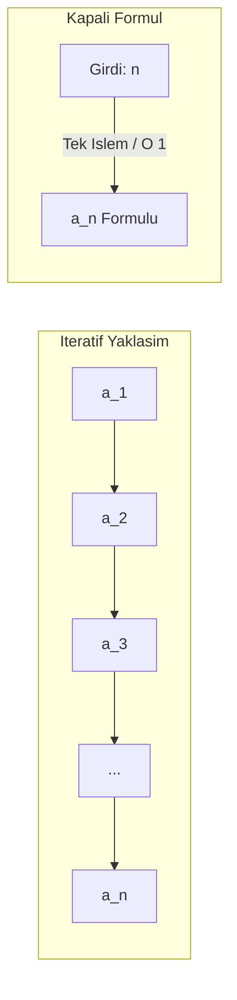

# Bölüm 1: Diziler ve Formülleri (Açık, Kapalı ve İteratif Yapılar)

Bu belgede; **Aritmetik**, **Geometrik**, **Fibonacci**, **Lucas**, **Catalan**, **Harmonik** ve **Polinomsal** gibi temel ve ileri düzey dizilerin matematiksel yapıları incelenmekte; dizilerin **açık (kapalı) formülleri** ile **özyinelemeli (iteratif) tanımları** arasındaki farklar, sonsuza gidiş (limit/yakınsama/ıraksama) durumları ve hesaplama karmaşıklıkları detaylandırılmaktadır.

---

## 1. Temel Kavramlar: Dizi, İterasyon ve Kapalı Form

Matematikte bir **dizi (sequence)**, pozitif tam sayılar kümesinden ($\mathbb{N}^+ = \{1, 2, 3, \dots\}$) gerçel (veya karmaşık) sayılara tanımlanan bir fonksiyondur:
$$f: \mathbb{N}^+ \to \mathbb{R}, \quad f(n) = a_n$$

Diziler genellikle iki farklı şekilde tanımlanır ve ifade edilir:

### A. Özyinelemeli / İteratif Formül (Recursive / Recurrence Relation)
Bir terimin kendisinden önceki terim(ler) cinsinden ifade edilmesidir.
- **Özellik:** $n$. terimi ($a_n$) bulmak için $a_1, a_2, \dots, a_{n-1}$ ara terimlerinin adım adım hesaplanması gerekir.
- **Örnek:** $a_1 = 1$ ve $a_n = a_{n-1} + 3$

### B. Açık / Kapalı Formül (Explicit / Closed-Form Formula)
$n$. terimi, ara terimleri hesaplamaya gerek duymaksızın doğrudan $n$ indisinin bir fonksiyonu olarak tek adımda $O(1)$ veren cebirsel ifadedir.
- **Özellik:** $a_n = f(n)$ biçimindedir. İstenilen herhangi bir $n$ değeri doğrudan yerine yazılarak terim elde edilir.
- **Örnek:** $a_n = 3n - 2$

> [!NOTE]
> **Terminoloji Notu: "Açık" ve "Kapalı" Formül Zıt Anlamlı mıdır?**
> 
> Günlük konuşma dilinde *"açık"* ve *"kapalı"* zıt anlamlı görünse de, matematikte bu iki terim formülün **farklı iki özelliğini** tanımlar:
> 
> 1. **Açık Formül (Explicit Formula):**
>    - **Zıttı:** *Örtük (Implicit)* veya *Özyinelemeli / İteratif (Recursive)* formül.
>    - **Anlamı:** $a_n$ değeri, önceki terimlere ($a_{n-1}, a_{n-2}$) bağımlı olmadan doğrudan girdi olan $n$ parametresine bağlı olarak **açıkça** ($a_n = f(n)$) tanımlanır.
> 
> 2. **Kapalı Form / Kapalı Formül (Closed-Form Expression):**
>    - **Zıttı:** *Ucu açık / sonsuz işlemler* (sonsuz seriler $\sum_{k=1}^\infty$, limitler $\lim$, integral sembolleri veya bitmeyen algoritmik döngüler).
>    - **Anlamı:** İfadenin, sonlu sayıda iyi tanımlanmış temel işlemle ($+, -, \times, \div$, üs, kök vb.) kesin olarak hesaplanabilir, tamamlanmış ve sınırları belirlenmiş ("kapalı paket") bir biçimde sunulmasıdır.
> 
> **Sonuç:** Bir aritmetik dizi formülü ($a_n = a_1 + (n-1)d$) veya Fibonacci için Binet formülü hem **Açık (Explicit)** bir formüldür (çünkü önceki terimlere ihtiyaç duymaz), hem de **Kapalı Formdadır (Closed-Form)** (çünkü sonlu sayıda işlemle doğrudan hesaplanır).

---

## 2. Dizilerin Açık Formülleri Var mıdır?

> **Soru:** Tüm dizilerin açık formülleri var mıdır, yoksa bazıları sadece iteratif midir?

**Cevap:**
1. **Lineer Reküranslar (Linear Recurrences):** Aritmetik, geometrik, Fibonacci, Lucas gibi sabit katsayılı lineer rekürans bağıntılarına sahip dizilerin **tamamının açık (kapalı) formülleri vardır**. Bu formüller *Karakteristik Denklem Metodu* veya *Üreteç Fonksiyonları (Generating Functions)* kullanılarak kesin bir şekilde türetilebilir.
2. **Kombinatorik ve Polinomsal Diziler:** Catalan sayıları, üçgensel sayılar, Bernoulli sayıları gibi birçok dizinin kombinatorik açık formülleri mevcuttur.
3. **Açık Formülü Bulunmayan / Bilinmeyen Diziler:**
   - **Asal Sayılar Dizisi ($p_n$):** Asal sayılar için pratikte hesaplama sağlayan basit ve analitik bir kapalı formül yoktur (Mills ve Willans gibi teorik formüller mevcuttur ancak hesaplanabilirlikleri pratik değildir).
   - **Kaotik ve Gayri-Lineer Reküranslar:** Örneğin *Collatz Dizisi* ($n$ çiftse $n/2$, tekse $3n+1$) gibi dinamik sistem dizilerinde genel terimi $n$'ye bağlı veren genel bir kapalı formül bilinmemektedir.

---

## 3. Dizilerin Detaylı İncelenmesi

### 3.1. Aritmetik Dizi (Arithmetic Progression)
Ardışık terimleri arasındaki farkı sabit ($d$) olan dizilerdir.

- **Ortak Fark ($d$):** $d = a_n - a_{n-1}$
- **İteratif Tanım:**
  $$a_1 = c, \quad a_n = a_{n-1} + d$$
- **Açık (Kapalı) Formül:**
  $$a_n = a_1 + (n - 1)d$$
- **İlk $n$ Terim Toplamı (Aritmetik Seri):**
  $$S_n = \sum_{k=1}^n a_k = \frac{n(a_1 + a_n)}{2} = \frac{n}{2} \left[ 2a_1 + (n - 1)d \right]$$
- **Sonsuzdaki Davranışı ($n \to \infty$):**
  - $d > 0 \implies \lim_{n \to \infty} a_n = +\infty$ (ıraksar)
  - $d < 0 \implies \lim_{n \to \infty} a_n = -\infty$ (ıraksar)
  - $d = 0 \implies a_n = a_1$ (sabit dizi, yakınsar)
  - Seri toplamı ($S_n$); $d \neq 0$ veya $a_1 \neq 0$ iken sonsuza gider ($\pm\infty$).

---

### 3.2. Geometrik Dizi (Geometric Progression)
Ardışık terimleri arasındaki oranı sabit ($r$) olan dizilerdir.

- **Ortak Çarpan ($r$):** $r = \frac{a_n}{a_{n-1}} \quad (r \neq 0)$
- **İteratif Tanım:**
  $$a_1 = c, \quad a_n = a_{n-1} \cdot r$$
- **Açık (Kapalı) Formül:**
  $$a_n = a_1 \cdot r^{n-1}$$
- **İlk $n$ Terim Toplamı (Geometrik Seri):**
  $$S_n = a_1 \frac{1 - r^n}{1 - r} \quad (r \neq 1)$$
- **Sonsuzdaki Davranışı ve Sonsuz Seri Toplamı:**
  - **$|r| < 1$ (Önemli Durum):**
    - $n \to \infty$ iken $r^n \to 0$ olur, dolayısıyla $\lim_{n \to \infty} a_n = 0$.
    - **Sonsuz Terim Toplamı ($S_\infty$):** Terimler toplanarak sonlu bir limite yakınsar:
      $$S_\infty = \sum_{n=1}^\infty a_1 r^{n-1} = \frac{a_1}{1 - r}$$
  - **$|r| \ge 1$:**
    - Dizi ve seri sonsuza doğru ıraksar (veya $r \le -1$ ise salınım yapar).

---

### 3.3. Fibonacci Dizisi (Fibonacci Sequence)
Her terimi kendisinden önceki iki terimin toplamı olan dizidir.

- **Dizi:** $0, 1, 1, 2, 3, 5, 8, 13, 21, 34, 55, 89, \dots$
- **İteratif Tanım:**
  $$F_0 = 0, \quad F_1 = 1, \quad F_n = F_{n-1} + F_{n-2} \quad (n \ge 2)$$
- **Açık (Kapalı) Formül — Binet Formülü:**
  Fibonacci dizisinin de açık bir formülü vardır ve **Binet Formülü** olarak adlandırılır:
  $$F_n = \frac{\phi^n - \psi^n}{\sqrt{5}} = \frac{1}{\sqrt{5}} \left[ \left(\frac{1+\sqrt{5}}{2}\right)^n - \left(\frac{1-\sqrt{5}}{2}\right)^n \right]$$
  - Burada:
    - $\phi = \frac{1+\sqrt{5}}{2} \approx 1.6180339887\dots$ (**Altın Oran**)
    - $\psi = \frac{1-\sqrt{5}}{2} = -\frac{1}{\phi} \approx -0.6180339887\dots$
  - **Pratik Hesaplama:** $|\psi| < 1$ olduğundan, $n$ büyüdükçe $\psi^n \to 0$ olur. Dolayısıyla $F_n$, $\frac{\phi^n}{\sqrt{5}}$ değerine en yakın tam sayıdır:
    $$F_n = \left\lfloor \frac{\phi^n}{\sqrt{5}} + \frac{1}{2} \right\rfloor = \text{round}\left( \frac{\phi^n}{\sqrt{5}} \right)$$
- **Sonsuzdaki Davranışı:**
  - $n \to \infty$ iken $F_n \to \infty$ (ıraksar).
  - Ardışık terimlerin oranı ise Altın Oran'a yakınsar:
    $$\lim_{n \to \infty} \frac{F_{n+1}}{F_n} = \phi \approx 1.6180339887$$

---

### 3.4. Lucas Dizisi (Lucas Sequence)
Fibonacci dizisiyle aynı rekürans kuralına sahip olup başlangıç koşulları farklıdır.

- **Dizi:** $2, 1, 3, 4, 7, 11, 18, 29, 47, \dots$
- **İteratif Tanım:**
  $$L_0 = 2, \quad L_1 = 1, \quad L_n = L_{n-1} + L_{n-2}$$
- **Açık (Kapalı) Formül:**
  $$L_n = \phi^n + \psi^n = \left(\frac{1+\sqrt{5}}{2}\right)^n + \left(\frac{1-\sqrt{5}}{2}\right)^n$$
- **Fibonacci ile İlişkisi:** $L_n = F_{n-1} + F_{n+1}$

---

### 3.5. Catalan Sayıları (Catalan Numbers)
Kombinatorik, parantez eşleştirme ve ikili ağaç sayımlarında karşımıza çıkar.

- **Dizi:** $1, 1, 2, 5, 14, 42, 132, 429, \dots$
- **İteratif Tanım:**
  $$C_0 = 1, \quad C_{n+1} = \sum_{i=0}^n C_i C_{n-i}$$
- **Açık (Kapalı) Formül:**
  $$C_n = \frac{1}{n+1}\binom{2n}{n} = \frac{(2n)!}{(n+1)!\,n!}$$

---

### 3.6. Harmonik Dizi ve Seri (Harmonic Sequence & Series)
Terimleri ardışık pozitif tam sayıların çarpmaya göre tersi olan dizidir.

- **Dizi:** $1, \frac{1}{2}, \frac{1}{3}, \frac{1}{4}, \dots, \frac{1}{n}, \dots$
- **Açık Formül:**
  $$a_n = \frac{1}{n}$$
- **Sonsuzdaki Davranışı:**
  - $\lim_{n \to \infty} a_n = 0$ (terimler sıfıra yakınsar).
  - **Harmonik Seri ($H_n = \sum_{k=1}^n \frac{1}{k}$):** Terimler sıfıra gitmesine rağmen toplam sonsuza ıraksar:
    $$\lim_{n \to \infty} H_n = +\infty \quad (\text{Asimptotik olarak } H_n \approx \ln n + \gamma)$$
    *(Burada $\gamma \approx 0.5772$ Euler-Mascheroni sabitidir).*

---

### 3.7. Polinomsal ve Çokgensel Sayı Dizileri

| Dizi Türü | İteratif İlişki | Açık (Kapalı) Formül ($a_n$) | İlk Birkaç Terim |
| :--- | :--- | :--- | :--- |
| **Üçgensel Sayılar ($T_n$)** | $T_n = T_{n-1} + n$ | $T_n = \frac{n(n+1)}{2}$ | $1, 3, 6, 10, 15, 21, \dots$ |
| **Karesel Sayılar ($S_n$)** | $S_n = S_{n-1} + (2n-1)$ | $S_n = n^2$ | $1, 4, 9, 16, 25, 36, \dots$ |
| **Küp Sayılar ($K_n$)** | $K_n = K_{n-1} + (3n^2 - 3n + 1)$ | $K_n = n^3$ | $1, 8, 27, 64, 125, \dots$ |
| **Faktöriyel Dizisi ($n!$)** | $n! = n \cdot (n-1)!$ | $\Gamma(n+1)$ (veya Stirling: $\approx \sqrt{2\pi n}(\frac{n}{e})^n$) | $1, 2, 6, 24, 120, 720, \dots$ |

---

## 4. İteratif ve Açık Formüllerin Karşılaştırması

Hesaplamalı bilimler ve yazılım mühendisliği açısından formül tiplerinin analizi:

| Kriter | İteratif / Rekürsif Yöntem | Açık / Kapalı Formül Yöntemi |
| :--- | :--- | :--- |
| **Zaman Karmaşıklığı** | $O(n)$ (Doğrusal) veya $O(2^n)$ (Saf naif Fibonacci) | Genellikle $O(1)$ (Sabit zaman) |
| **Bellek Karmaşıklığı** | $O(1)$ (Döngü ile) veya $O(n)$ (Çağrı yığını / Call stack) | $O(1)$ |
| **Sayısal Hassasiyet (Precision)** | Tam sayılarla çalışıldığında tam sonuç verir (Tam hassasiyet). | İrrasyonel sayılar ($\sqrt{5}, \pi, e$) floating-point yuvarlama hatalarına yol açabilir. |
| **Çok Büyük $n$ Değerleri** | $n = 10^9$ için döngü süresi uzun sürer. | $n = 10^9$ için anında sonuç üretir (taşma kontrolü gerekir). |

---

## 5. Özet ve Sonuç

1. **Açık Formül Varlığı:** Aritmetik, Geometrik, Fibonacci, Lucas, Catalan ve Polinomsal dizilerin **her birinin kesin açık (kapalı) formülü vardır**.
2. **Fibonacci İstisnası Değildir:** Fibonacci dizisi yalnızca iteratif olarak değil, **Binet Formülü** sayesinde doğrudan $n$. terim olarak hesaplanabilir.
3. **Sonsuz Formüller ve Yakınsama:** 
   - Aritmetik dizi ve Fibonacci dizisi sonsuzda sonsuza ($\infty$) gider.
   - Geometrik dizide $|r| < 1$ olduğunda dizi sıfıra, sonsuz terim toplamı ise $\frac{a_1}{1-r}$ sonlu değerine yakınsar.
   - Harmonik dizide terimler sıfıra gitmesine karşın seri toplamı sonsuza ıraksar.
