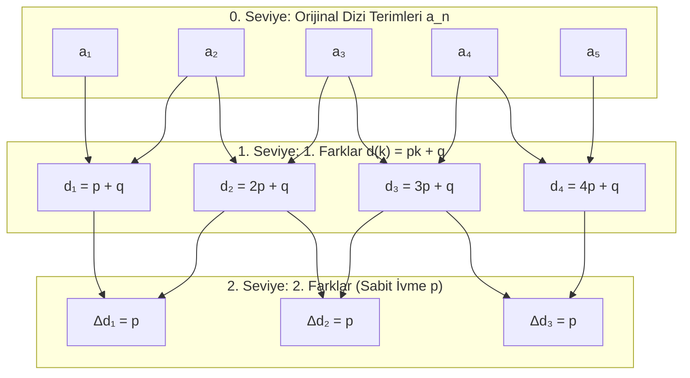

# Bölüm 2: Sabit Olmayan Artış Miktarı (Yapısal Genelleştirme ve Fonksiyonel Aritmetik Diziler)

> [!IMPORTANT]
> **Metodolojik İlke (Yapısal Koruma ve Genelleştirme Kuralı):**
> Bu çalışmada amaç dizileri klasik $An^2 + Bn + C$ gibi açılmış polinomlara indirgeyip iskeleti yok etmek **değildir**. 
> Amacımız, aritmetik dizinin temel formül iskeleti olan:
> $$a_n = a_1 + (n - 1) \cdot D(n)$$
> formunu **sadeleştirmeden korumak** ve artış miktarının ($D(n)$) doğasını inceleyerek üst düzey matematiksel genelleştirmelere ulaşmaktır.

---

## 1. Giriş: Aritmetik İskeletin Korunması

Klasik bir aritmetik dizide:
- Ardışık fark: $\Delta a_k = a_{k+1} - a_k = d \quad (\text{Sabit})$
- Genel Terim:
  $$a_n = a_1 + (n - 1) \cdot [d]$$

Burada $(n - 1)$ çarpanı, $a_1$'den $a_n$'e ulaşmak için atılan **adım sayısını** temsil eder. $[d]$ ise her adımda eklenen sabit miktardır.

---

### Yeni Yaklaşım: $d$'nin Adıma Bağlı Fonksiyon Olması $d(k)$

Artış miktarının her adımda değiştiğini ve $k$. adımdaki artışın $d(k)$ olduğunu varsayalım:
$$\Delta a_k = a_{k+1} - a_k = d(k)$$

$a_1$'den başlayarak $n$. terime kadar olan teleskopik toplam:
$$a_n = a_1 + \sum_{k=1}^{n-1} d(k)$$

Hedefimiz bu toplamı, ana aritmetik iskeleti bozmadan **$(n - 1)$ parantezinde** ifade etmektir:
$$a_n = a_1 + (n - 1) \cdot \overline{d}(n)$$

Burada $\overline{d}(n)$, ilk $(n-1)$ adım boyunca gerçekleşen **etkin / ortalama artış miktarıdır**:
$$\overline{d}(n) = \frac{1}{n-1} \sum_{k=1}^{n-1} d(k)$$

---

## 2. Artış Miktarının Lineer (1. Derece) Fonksiyon Olması Durumu

Artış fonksiyonunun 1. dereceden doğrusal bir yapıya sahip olduğunu varsayalım:
$$d(k) = p \cdot k + q$$

### 2.1. İskeleti Koruyarak Formülün Türetilmesi

Adımların toplamı:
$$\sum_{k=1}^{n-1} d(k) = \sum_{k=1}^{n-1} (p \cdot k + q) = p \sum_{k=1}^{n-1} k + q \sum_{k=1}^{n-1} 1$$

Temel toplamları yerine koyalım:
$$\sum_{k=1}^{n-1} 1 = (n - 1)$$
$$\sum_{k=1}^{n-1} k = \frac{(n - 1) \cdot n}{2}$$

Bu ifadeleri $(n - 1)$ ortak parantezine alarak yazalım (parantezleri **dağıtmıyoruz**):
$$\sum_{k=1}^{n-1} d(k) = p \cdot \frac{(n - 1) \cdot n}{2} + q \cdot (n - 1) = (n - 1) \cdot \left[ \frac{p \cdot n}{2} + q \right]$$

---

### 2.2. Lineer Artış İçin Genel Formül

Böylece $a_n$ dizisi, klasik aritmetik dizi formunun doğrudan bir genelleştirmesi olarak elde edilir:

$$\mathbf{a_n = a_1 + (n - 1) \cdot \left[ \frac{p \cdot n}{2} + q \right]}$$

> [!NOTE]
> **Yapısal Benzerlik:**
> - Sabit artışta: $a_n = a_1 + (n - 1) \cdot [d]$
> - Lineer artışta: $a_n = a_1 + (n - 1) \cdot \left[ \frac{pn}{2} + q \right]$
> 
> Köşeli parantez içindeki $\left[ \frac{pn}{2} + q \right]$ ifadesi, ilk adım ile son adım arasındaki aritmetik ortalamadır:
> $$\frac{d(1) + d(n-1)}{2} = \frac{(p(1)+q) + (p(n-1)+q)}{2} = \frac{pn + 2q}{2} = \frac{pn}{2} + q$$

---

## 3. Sonlu Farklar Piramidi ve İvme Seviyeleri

---

## 4. Somut Dizilerin $a_1 + (n-1)[\dots]$ Formunda İncelenmesi

Sadeleştirme yapmadan, iskelet formunu koruyarak temel dizileri yazalım:

### 4.1. Üçgensel Sayılar ($1, 3, 6, 10, 15, 21, \dots$)
- **Başlangıç:** $a_1 = 1$
- **Farklar:** $d(k) = k + 1 \implies p = 1, q = 1$
- **İskelet Formül:**
  $$a_n = 1 + (n - 1) \cdot \left[ \frac{1 \cdot n}{2} + 1 \right] = 1 + (n - 1) \cdot \left[ \frac{n + 2}{2} \right]$$
  *(Kontrol: $n=4 \implies 1 + 3 \cdot \left[\frac{6}{2}\right] = 1 + 9 = 10$)*

---

### 4.2. Tam Kare Sayılar ($1, 4, 9, 16, 25, 36, \dots$)
- **Başlangıç:** $a_1 = 1$
- **Farklar:** $d(k) = 2k + 1 \implies p = 2, q = 1$
- **İskelet Formül:**
  $$a_n = 1 + (n - 1) \cdot \left[ \frac{2 \cdot n}{2} + 1 \right] = 1 + (n - 1) \cdot [n + 1]$$
  *(Kontrol: $n=5 \implies 1 + 4 \cdot [6] = 1 + 24 = 25$)*
  *(Dikkat: $(n-1)(n+1) = n^2 - 1$ olduğu için $1 + (n^2 - 1) = n^2$ eşitliği iskelet bozulmadan açıkça görülmektedir!)*

---

### 4.3. Pronic (Dikdörtgensel) Sayılar ($2, 6, 12, 20, 30, \dots$)
- **Başlangıç:** $a_1 = 2$
- **Farklar:** $d(k) = 2k + 2 \implies p = 2, q = 2$
- **İskelet Formül:**
  $$a_n = 2 + (n - 1) \cdot \left[ \frac{2 \cdot n}{2} + 2 \right] = 2 + (n - 1) \cdot [n + 2]$$
  *(Kontrol: $n=4 \implies 2 + 3 \cdot [6] = 2 + 18 = 20$)*

---

## 5. İleri Düzey Genelleştirme: $d(k)$ İkinci Dereceden (Kuadratik) İse

Eğer artış miktarı da sabit bir ivmeyle değil, karesel bir hızla artıyorsa:
$$d(k) = p \cdot k^2 + q \cdot k + r$$

Toplam formülünde yerine yazalım:
$$\sum_{k=1}^{n-1} (p k^2 + q k + r) = p \sum_{k=1}^{n-1} k^2 + q \sum_{k=1}^{n-1} k + r \sum_{k=1}^{n-1} 1$$

Bilinen toplam özdeşliklerini $(n-1)$ çarpanı dışarıda kalacak şekilde yazalım:
- $\sum_{k=1}^{n-1} 1 = (n - 1)$
- $\sum_{k=1}^{n-1} k = (n - 1) \cdot \left[ \frac{n}{2} \right]$
- $\sum_{k=1}^{n-1} k^2 = \frac{(n-1)n(2n-1)}{6} = (n - 1) \cdot \left[ \frac{n(2n - 1)}{6} \right]$

### Kuadratik Artış İçin İskelet Formülü:

$$\mathbf{a_n = a_1 + (n - 1) \cdot \left[ p \cdot \frac{n(2n - 1)}{6} + q \cdot \frac{n}{2} + r \right]}$$

---

## 6. Büyük Genelleştirme Hiyerarşisi (Açılmamış Formlar Tablosu)

| Artış Fonksiyonu $d(k)$ | Derece | $a_n$ Aritmetik İskelet Formülü ($a_1 + (n-1) \cdot D(n)$) | $D(n)$ Etkin Artış İfadesi |
| :--- | :---: | :--- | :--- |
| **Sabit ($d$)** | $0$ | $a_n = a_1 + (n - 1) \cdot [d]$ | $d$ |
| **Lineer ($pk + q$)** | $1$ | $a_n = a_1 + (n - 1) \cdot \left[ \frac{pn}{2} + q \right]$ | $\frac{pn}{2} + q$ |
| **Kuadratik ($pk^2 + qk + r$)** | $2$ | $a_n = a_1 + (n - 1) \cdot \left[ p\frac{n(2n-1)}{6} + q\frac{n}{2} + r \right]$ | $p\frac{n(2n-1)}{6} + q\frac{n}{2} + r$ |
| **Kübik ($pk^3 + \dots$)** | $3$ | $a_n = a_1 + (n - 1) \cdot \left[ p\frac{n^2(n-1)}{4} + \dots \right]$ | 3. Derece İfade |
| **Üstel ($c \cdot r^k$)** | $\infty$ | $a_n = a_1 + (n - 1) \cdot \left[ \frac{c \cdot r (r^{n-1} - 1)}{(n - 1)(r - 1)} \right]$ | Geometrik Ortalama Artış |

---

## 7. Çıkarımlar ve Genelleştirme Gücü

1. **İskelet Değişmezliği (Invariant Structure):** Artış miktarı hangi fonksiyona tabi olursa olsun, her dizi **$a_1 + (n-1) \cdot D(n)$** şeklinde temsil edilebilir.
2. **$(n-1)$ Faktörünün Anlamı:** Formül açılmadığı sürece $(n-1)$ çarpanı, sistemin diskret (ayrık) adımlarla $a_1$ tabanından uzaklaşma derecesini doğrudan görünür kılar.
3. **Analitik Geçiş:** $D(n)$ ifadesi, $1$'den $(n-1)$'e kadar olan adımlardaki artışların ağırlıklı ortalaması olarak genel bir operatör gibi incelenebilir.
