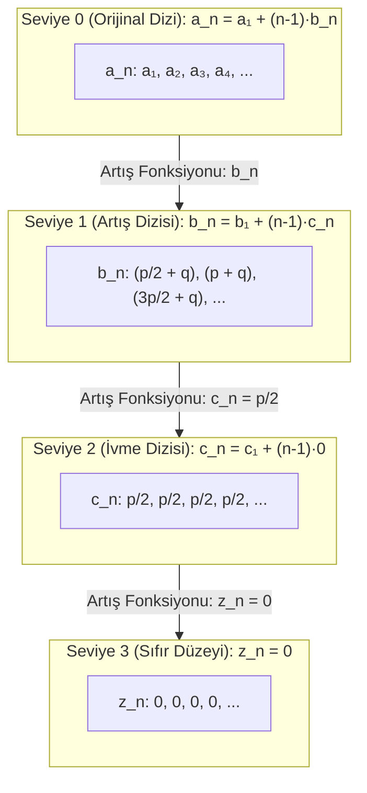

# Bölüm 3: Artış Dizileri ve Farklar Hiyerarşisi (Dizi İçinde Dizi Mimarisi)

> [!IMPORTANT]
> **Temel İlke (Fraktal Dizi Modeli):**
> Bir dizinin $n$. terimini veren formüldeki artış ifadesi $D(n)$, bağımsız bir cebirsel terim değil; **kendisi de bir dizidir**.
> Bu bölümde, en üstteki orijinal diziden başlayarak sıfır artış seviyesine kadar inen her kademeyi birer **Dizi Formülü** olarak modelleyecek ve sonlu farklar piramidini **iç içe geçmiş diziler hiyerarşisi** olarak inşa edeceğiz.

---

## 1. Dizi İçinde Dizi Kavramı

2. Bölüm'de elde ettiğimiz sadeleştirilmemiş genel formül:
$$a_n = a_1 + (n - 1) \cdot D(n)$$

Burada $D(n) = \frac{p \cdot n}{2} + q$ ifadesini yeni bir dizi olarak tanımlayalım ve buna **1. Seviye Artış Dizisi ($b_n$)** diyelim:
$$b_n = D(n) = \frac{p \cdot n}{2} + q$$

Bu tanım yapıldığında orijinal dizi şu sade forma kavuşur:
$$a_n = a_1 + (n - 1) \cdot [b_n]$$

Şimdi $b_n$ dizisinin kendi matematiksel davranışını bir dizi olarak inceleyelim.

---

## 2. Seviye Seviye Dizi Hiyerarşisi

### Seviye 0: Orijinal Dizi ($a_n$)
En üstteki ana dizidir (2. Derece Kuadratik Dizi):
- **Formül:** $a_n = a_1 + (n - 1) \cdot [b_n]$

---

### Seviye 1: Artış Dizisi ($b_n$)
$b_n = \frac{p \cdot n}{2} + q$ dizisinin terimlerini ve ardışık farkını bulalım:

- **İlk Terim ($b_1$):**
  $$b_1 = \frac{p \cdot 1}{2} + q = \frac{p}{2} + q$$
- **İkinci Terim ($b_2$):**
  $$b_2 = \frac{p \cdot 2}{2} + q = p + q$$
- **Üçüncü Terim ($b_3$):**
  $$b_3 = \frac{p \cdot 3}{2} + q = \frac{3p}{2} + q$$
- **$b_n$'nin Kendi Artış Miktarı ($\Delta b_n$ / "d'nin d'si"):**
  $$d_b = b_2 - b_1 = (p + q) - \left(\frac{p}{2} + q\right) = \frac{p}{2}$$
  $$b_3 - b_2 = \left(\frac{3p}{2} + q\right) - (p + q) = \frac{p}{2}$$

Görüldüğü üzere, $b_n$ dizisinin ardışık terimleri arasındaki artış **sabit ve $\frac{p}{2}$'dir**.

Dolayısıyla $b_n$ dizisinin kendi aritmetik dizi formülü:
$$b_n = b_1 + (n - 1) \cdot [d_b]$$
$$b_n = \left( \frac{p}{2} + q \right) + (n - 1) \cdot \left[ \frac{p}{2} \right]$$

---

### Seviye 2: İvme Dizisi ($c_n$)
$b_n$ dizisinin artış miktarı olan $\frac{p}{2}$ değerini de bir dizi olarak modelleyelim:
$$c_n = \frac{p}{2} \quad \left( \frac{p}{2}, \frac{p}{2}, \frac{p}{2}, \frac{p}{2}, \dots \right)$$

- **İlk Terim ($c_1$):** $c_1 = \frac{p}{2}$
- **Artış Miktarı ($\Delta c_n$):** $d_c = 0$
- **Kendi Formülü:**
  $$c_n = c_1 + (n - 1) \cdot [0] = \frac{p}{2} + (n - 1) \cdot [0]$$

---

### Seviye 3: Sıfır / Denge Dizisi ($z_n$)
- **Dizi:** $0, 0, 0, 0, \dots$
- **Formül:** $z_n = 0 + (n - 1) \cdot [0]$

---

## 3. İç İçe Dizi Formülü (Nested Sequence Architecture)

Her seviyedeki formülü bir üst seviyedeki köşeli parantezin içine yerleştirelim:

```
[Seviye 0]: a_n = a_1 + (n-1) * [ b_n ]
                                   |
[Seviye 1]:               b_n = b_1 + (n-1) * [ c_n ]
                                                 |
[Seviye 2]:                             c_n = c_1 + (n-1) * [ 0 ]
```

Tüm sistemi tek bir birleşik iskelette yazarsak:

$$\mathbf{a_n = a_1 + (n - 1) \cdot \left[ b_1 + (n - 1) \cdot \left[ c_1 + (n - 1) \cdot [0] \right] \right]}$$

Katsayıları ($b_1 = \frac{p}{2} + q$ ve $c_1 = \frac{p}{2}$) yerine yazdığımızda:

$$\mathbf{a_n = a_1 + (n - 1) \cdot \left[ \left(\frac{p}{2} + q\right) + (n - 1) \cdot \left[ \frac{p}{2} \right] \right]}$$

> [!NOTE]
> **Adım Katmanlarının Fiziksel Anlamı:**
> - **$a_1$:** Başlangıç konumu (0. türev seviyesi).
> - **$(n - 1) \cdot b_1$:** Başlangıç hızının adımlarla birikimi ($b_1 = \frac{p}{2} + q$).
> - **$(n - 1)^2 \cdot c_1$:** Sabit ivmenin adımlarla ikinci dereceden birikimi ($c_1 = \frac{p}{2}$).

---

## 4. Sonlu Farklar Piramidinin Diziler Kümesi Olarak Gösterimi

Piramidin her bir basamağı artık bağımsız bir dizi ve formüldür:



---

## 5. Dizi Hiyerarşisi Tablosu

| Seviye | Dizi Adı | İlk Terim (1. Eleman) | Artış Miktarı ($d$) | Dizi Formülü |
| :---: | :--- | :---: | :---: | :--- |
| **0** | **Orijinal Dizi ($a_n$)** | $a_1$ | Değişken ($b_n$) | $a_n = a_1 + (n - 1) \cdot [b_n]$ |
| **1** | **Artış Dizisi ($b_n$)** | $b_1 = \frac{p}{2} + q$ | Sabit ($\frac{p}{2}$) | $b_n = \left(\frac{p}{2} + q\right) + (n - 1) \cdot \left[\frac{p}{2}\right]$ |
| **2** | **İvme Dizisi ($c_n$)** | $c_1 = \frac{p}{2}$ | $0$ | $c_n = \frac{p}{2} + (n - 1) \cdot [0]$ |
| **3** | **Sıfır Dizisi ($z_n$)** | $0$ | $0$ | $z_n = 0 + (n - 1) \cdot [0]$ |

---

## 6. Somut Örnekler Üzerinde İç İçe Dizi Analizi

### 6.1. Tam Kare Sayılar ($1, 4, 9, 16, 25, \dots$)
- **Parametreler:** $a_1 = 1$, $p = 2$, $q = 1$
- **Katsayılar:**
  - $b_1 = \frac{p}{2} + q = \frac{2}{2} + 1 = 2$
  - $c_1 = \frac{p}{2} = \frac{2}{2} = 1$
- **Hiyerarşik Dizi Formülleri:**
  - Seviye 1 Dizisi: $b_n = 2 + (n - 1) \cdot [1] = n + 1$
  - Seviye 0 Dizisi: 
    $$a_n = 1 + (n - 1) \cdot \Big[ 2 + (n - 1) \cdot [1] \Big]$$
- **Adım Adım Hesaplama ($n = 4$ için):**
  $$b_4 = 2 + (3) \cdot 1 = 5$$
  $$a_4 = 1 + (3) \cdot [5] = 16 \quad \checkmark$$

---

### 6.2. Üçgensel Sayılar ($1, 3, 6, 10, 15, \dots$)
- **Parametreler:** $a_1 = 1$, $p = 1$, $q = 1$
- **Katsayılar:**
  - $b_1 = \frac{1}{2} + 1 = \frac{3}{2}$
  - $c_1 = \frac{1}{2}$
- **Hiyerarşik Dizi Formülleri:**
  - Seviye 1 Dizisi: $b_n = \frac{3}{2} + (n - 1) \cdot \left[\frac{1}{2}\right]$
  - Seviye 0 Dizisi:
    $$a_n = 1 + (n - 1) \cdot \left[ \frac{3}{2} + (n - 1) \cdot \left[\frac{1}{2}\right] \right]$$
- **Adım Adım Hesaplama ($n = 4$ için):**
  $$b_4 = \frac{3}{2} + (3) \cdot \frac{1}{2} = \frac{6}{2} = 3$$
  $$a_4 = 1 + (3) \cdot [3] = 10 \quad \checkmark$$

---

### 6.3. Pronic (Dikdörtgensel) Sayılar ($2, 6, 12, 20, 30, \dots$)
- **Parametreler:** $a_1 = 2$, $p = 2$, $q = 2$
- **Katsayılar:**
  - $b_1 = \frac{2}{2} + 2 = 3$
  - $c_1 = \frac{2}{2} = 1$
- **Hiyerarşik Dizi Formülleri:**
  - Seviye 1 Dizisi: $b_n = 3 + (n - 1) \cdot [1]$
  - Seviye 0 Dizisi:
    $$a_n = 2 + (n - 1) \cdot \Big[ 3 + (n - 1) \cdot [1] \Big]$$
- **Adım Adım Hesaplama ($n = 4$ için):**
  $$b_4 = 3 + (3) \cdot 1 = 6$$
  $$a_4 = 2 + (3) \cdot [6] = 20 \quad \checkmark$$

---

## 7. Genel Kural: $m$. Dereceden Diziler İçin Fraktal Dizi Operatörü

Herhangi bir $m$. dereceden polinom dizi için bu hiyerarşi $m+1$ basamaklı bir zincir oluşturur:

$$S^{(0)}_n = S^{(0)}_1 + (n - 1) \cdot \left[ S^{(1)}_n \right]$$
$$S^{(1)}_n = S^{(1)}_1 + (n - 1) \cdot \left[ S^{(2)}_n \right]$$
$$S^{(2)}_n = S^{(2)}_1 + (n - 1) \cdot \left[ S^{(3)}_n \right]$$
$$\dots$$
$$S^{(m)}_n = S^{(m)}_1 + (n - 1) \cdot [0]$$

Bu yapı sayesinde, en karmaşık diziler dahi **yalnızca ilk terimler kümesi $\{S^{(0)}_1, S^{(1)}_1, S^{(2)}_1, \dots, S^{(m)}_1\}$ ve $(n-1)$ çarpanı** ile tek tip standart bir şablonla ifade edilebilir.
