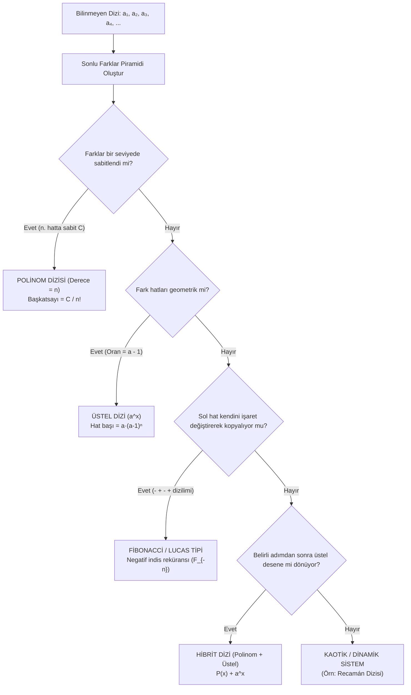

# Bölüm 4: Fark Piramidinde Dizi Davranışları ve Tersine Mühendislik (Formül Keşfi)

> [!IMPORTANT]
> **Temel Amaç (Dizilerin Genetik Analizi):**
> Verilen herhangi bir sayı dizisini **Sonlu Farklar Piramidine (Finite Difference Pyramid)** soktuğumuzda, dizi alt kademelerde kendine has bir "parmak izi / fark davranışı" sergiler. 
> Bu bölümde; **Polinomsal**, **Üstel ($a^x$)**, **Fibonacci / Lucas**, **Hibrit** ve **Kaotik (Recamán)** dizilerin fark piramidindeki davranışlarını inceleyecek, hat başları vektörlerini ve formül bulma (tersine mühendislik) yöntemini sistematikleştireceğiz.

---

## 1. Dizi Teşhis ve Çözüm Haritası (Genel Bakış)

Bir dizinin ilk birkaç terimi verildiğinde ($a_1, a_2, a_3, \dots$), alt alta farkları alınarak piramit oluşturulur. Farkların davranışı dizinin türünü doğrudan ele verir:



---

## 2. Polinomsal Dizilerin Davranışı ve "Hat Başları" Yöntemi

### 2.1. Sabitlenme İlkesi ve Derece Tespiti
Eğer bir dizinin $n$. fark hattındaki tüm değerler sabit bir $C$ sayısına eşitleniyorsa:
1. Dizi kesinlikle **$n$. dereceden** bir polinomdur ($f(x) = c_n x^n + c_{n-1} x^{n-1} + \dots + c_0$).
2. En yüksek dereceli terimin katsayısı:
   $$\mathbf{c_n = \frac{C}{n!}}$$

---

### 2.2. Monomların Temel Hat Başları Vektörleri (Basis Vectors)
Bir $x^m$ monomu fark piramidine sokulduğunda $x=1$ noktasındaki hat başları şu karakteristik vektörleri üretir:

| Monom ($x^m$) | Derece ($m$) | Hat Başları Vektörü $(v_0, v_1, \dots, v_m)$ | Son Terim ($m!$) |
| :---: | :---: | :--- | :---: |
| $\mathbf{x^0}$ | $0$ | $(1)$ | $0! = 1$ |
| $\mathbf{x^1}$ | $1$ | $(1, 1)$ | $1! = 1$ |
| $\mathbf{x^2}$ | $2$ | $(1, 3, 2)$ | $2! = 2$ |
| $\mathbf{x^3}$ | $3$ | $(1, 7, 12, 6)$ | $3! = 6$ |
| $\mathbf{x^4}$ | $4$ | $(1, 15, 50, 60, 24)$ | $4! = 24$ |
| $\mathbf{x^5}$ | $5$ | $(1, 31, 180, 390, 360, 120)$ | $5! = 120$ |

> [!NOTE]
> **Stirling Sayıları ile Derin Bağlantı:**
> Bu hat başı sayıları rastgele katsayılar değildir. $x^m$ monomunun $x=1$ noktasındaki $k$. ileri farkıdır ($\Delta^k(1^m)$) ve **2. Tür Stirling Sayıları ($S(m,k)$)** ile faktöriyellerin çarpımından türetilir:
> $$\Delta^k(1^m) = \sum_{j=0}^k (-1)^{k-j} \binom{k}{j} j^m = k! \cdot S(m, k)$$
> Projemizdeki [Stirling Hesaplayıcı.c](file:///c:/Users/icduser/Documents/GitHub/Ugraslar/FormulBulma/Stirling%20Hesaplay%C4%B1c%C4%B1/Stirling%20Hesaplay%C4%B1c%C4%B1.c) programının varlık sebebi, işte bu hat başı dönüşüm matrislerini inşa etmektir!

---

### 2.3. Adım Adım Polinom Çözüm Örneği ($9, 12, 17, 19, 21$)

PDF'te incelenen somut örneği ele alalım:
- **Dizi:** $9, 12, 17, 19, 21$
- **1. Farklar:** $3, 5, 2, 2$
- **2. Farklar:** $2, -3, 0$
- **3. Farklar:** $-5, 3$
- **4. Farklar:** $\mathbf{8}$ *(Sabit ivme)*

**Çözüm Adımları:**
1. 4. farkta sabit $8$ çıktığı için denklem 4. derecedendir: $c_4 = \frac{8}{4!} = \frac{8}{24} = \frac{1}{3}$.
2. Ana dizinin hat başları vektörü: $\mathbf{H} = (9, 3, 2, -5, 8)$.
3. 4. derece monomun payı düşülür:
   $$\mathbf{H'} = (9, 3, 2, -5, 8) - \frac{1}{3} \cdot (1, 15, 50, 60, 24)$$
4. Kalan 3. derece vektörün son elemanı $3! = 6$'ya bölünerek $x^3$'ün katsayısı $c_3$ bulunur.
5. Bu işlem $x^0$'a kadar tekrarlanarak $5 \times 5$'lik matris çözülmüş olur.

---

## 3. Üstel (Geometrik) Dizilerin Davranışı ($a^x$)

Üstel fonksiyonlar için ileri fark türevi:
$$\Delta(a^x) = a^{x+1} - a^x = a^x(a - 1)$$

$k$. fark seviyesine inildikçe ifade her basamakta $(a - 1)$ ile çarpılır. $k$. fark hattının başındaki değer:
$$\mathbf{H_k = a \cdot (a - 1)^k}$$

### 3.1. $2^x$ Dizisi ($2, 4, 8, 16, 32, 64, \dots$)
- **Çarpan:** $(a - 1) = (2 - 1) = 1$
- **Fark Piramidi:**
  - Seviye 0: $2, 4, 8, 16, 32, 64$
  - Seviye 1: $2, 4, 8, 16, 32$
  - Seviye 2: $2, 4, 8, 16$
  - Seviye 3: $2, 4, 8$
- **Karakter:** Hat başları daima $(2, 2, 2, 2, \dots)$ olarak **asla değişmez ve sonsuza kadar gider**.

---

### 3.2. $3^x$ Dizisi ($3, 9, 27, 81, 243, \dots$)
- **Çarpan:** $(a - 1) = (3 - 1) = 2$
- **Fark Piramidi:**
  - Seviye 0: $3, 9, 27, 81, 243$
  - Seviye 1: $6, 18, 54, 162 \quad (\times 2)$
  - Seviye 2: $12, 36, 108 \quad (\times 2)$
  - Seviye 3: $24, 72 \quad (\times 2)$
  - Seviye 4: $48 \quad (\times 2)$
- **Karakter:** Hat başları $3 \cdot 2^k$ geometrik dizisini oluşturur: $(3, 6, 12, 24, 48, \dots)$.

---

### 3.3. $4^x$ Dizisi ($4, 16, 64, 256, \dots$)
- **Çarpan:** $(a - 1) = (4 - 1) = 3$
- **Karakter:** Hat başları her basamakta $3$ ile çarpılır: $(4, 12, 36, 108, \dots)$.

---

## 4. Fibonacci ve Lucas Dizilerinin Davranışı (Negatif İndis / Salınım)

### 4.1. Fibonacci Dizisi ($1, 1, 2, 3, 5, 8, 13, 21, \dots$)
Fibonacci reküransında $F_{n+1} - F_n = F_{n-1}$ olduğundan, fark piramidinin sol kenarında geriye doğru işaret değiştiren **Negafibonacci** sayıları belirir:

```
Dizi:          1    1    2    3    5    8    13    21
1. Fark:         0    1    1    2    3    5     8
2. Fark:            1    0    1    1    2    3
3. Fark:              -1    1    0    1    1
4. Fark:                 2   -1    1    0
5. Fark:                   -3    2   -1
6. Fark:                      5   -3
7. Fark:                        -8
```

- **Sol Hat Başları:** $0, 1, -1, 2, -3, 5, -8, 13, \dots$
- **Teorem:** $F_{-n} = (-1)^{n+1} F_n$. Piramit Fibonacci dizisini zamanda geriye doğru yürütür.

---

### 4.2. Lucas Dizisi ($2, 1, 3, 4, 7, 11, 18, 29, \dots$)
- **Sol Hat Başları:** $-1, 3, -4, 7, -11, 18, \dots$
- **Teorem:** $L_{-n} = (-1)^n L_n$ (Negalucas özelliği).

---

## 5. Hibrit Diziler ($P(x) + a^x$ veya $x^b \cdot a^x$)

Eğer bir dizi hem polinom hem de üstel bileşen içeriyorsa (örneğin $x^2 + 2^x$):
1. Polinom kısmı ($x^2$), $2$ adım sonra fark piramidinde sıfırlanır ($3.$ farkta yok olur).
2. $3.$ farktan itibaren polinom tamamen temizlenir ve geriye yalnızca $2^x$'in sonsuza giden $(2, 2, 2, \dots)$ üstel deseni kalır.
3. Bu sayede karmaşık hibrit fonksiyonlar katman katman soyularak çözülür.

---

## 6. Kaotik ve Kural Tabanlı Diziler (Recamán Örneği)

- **Recamán Dizisi:** $a_0 = 0, \quad a_n = a_{n-1} - n \text{ (eğer pozitif ve dizide yoksa)}, \text{ aksi halde } a_{n-1} + n$
- **Dizi:** $0, 1, 3, 6, 2, 7, 13, 20, 12, 21, 11, 22, 10, 23, 9, 24, \dots$
- **Fark Piramidi Davranışı:** Farklar alındığında ne sabit bir sayıya ne de üstel/periyodik bir katsayıya ulaşılır.
- **Sonuç:** Lokal geçmişe bağımlı ve fraktal yapılı diziler sonlu farklar yöntemiyle kapalı cebirsel forma indirgenemez ("Her dizide anlamlı bir şey gözükmüyor tabii").

---

## 7. Büyük Karşılaştırma Matrisi

| Dizi Sınıfı | Örnek Dizi | Fark Piramidindeki Davranış | Hat Başı Karakteri | Çözüm Yaklaşımı |
| :--- | :--- | :--- | :--- | :--- |
| **Aritmetik Dizi** | $3, 7, 11, 15, \dots$ | 1. farkta sabitlenir | $(a_1, d)$ | $a_1 + (n-1)d$ |
| **Kuadratik Dizi** | $1, 4, 9, 16, \dots$ | 2. farkta sabitlenir | $(1, 3, 2)$ | $a_1 + (n-1)\left[\frac{pn}{2}+q\right]$ |
| **$m$. Derece Polinom** | $f(x) = \sum c_k x^k$ | $m$. farkta sabitlenir ($m! \cdot c_m$) | Stirling Hat Başları Vektörü | $\frac{\Delta^m}{m!}$ ile Matris İndirgeme |
| **Üstel ($a^x$)** | $3, 9, 27, 81, \dots$ | Asla sabitlenmez, sonsuz piramit | $a(a-1)^k$ Geometrik Dizi | Oran tespiti ($r = a-1$) |
| **Fibonacci / Lucas** | $1, 1, 2, 3, 5, \dots$ | Periyodik kendini kopyalar | Negatif İndis ($F_{-n}$) Salınımı | Binet Formülü / Karakteristik Kök |
| **Hibrit ($P(x) + a^x$)** | $n^2 + 2^n$ | $\deg(P)$ adım sonra üstel kalır | Polinom elenir, üstel devam eder | Kademeli Ayrıştırma |
| **Kaotik (Recamán)** | $0, 1, 3, 6, 2, \dots$ | Düzensiz / Fraktal | Desensiz | Dinamik Durum Analizi |
