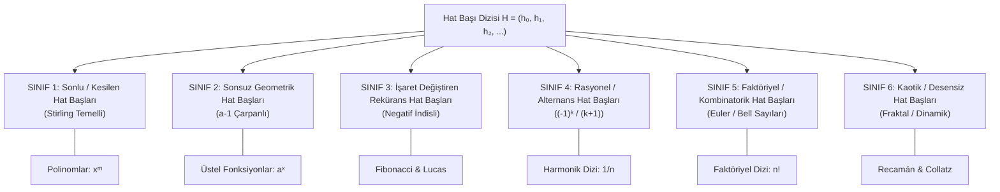

# Bölüm 5: Hat Başı Analizi ve Dizilerin Sınıflandırılması (Öncü Farklar Operatörü)

> [!IMPORTANT]
> **Temel Tanım (Hat Başı Dizisi / Öncü Farklar):**
> Bir $a_n$ dizisinin Sonlu Farklar Piramidi oluşturulduğunda, piramidin en sol kenarında (her fark seviyesinin ilk elemanında) beliren diziye **"Hat Başı Dizisi"** (İng. *Leading Differences Sequence* veya *Binomial Transform*) denir:
> $$\mathbf{H(a) = \big( h_0, h_1, h_2, h_3, \dots, h_k, \dots \big) = \big( a_1, \Delta a_1, \Delta^2 a_1, \Delta^3 a_1, \dots \big)}$$
> 
> $k$. hat başı teriminin kesin matematiksel formülü:
> $$h_k = \Delta^k a_1 = \sum_{j=0}^k (-1)^{k-j} \binom{k}{j} a_{j+1}$$

---

## 1. Evrensel Yeniden İnşa Teoremi (Gregory-Newton Formülü)

Bir dizinin yalnızca **Hat Başları Dizisi ($H$)** bilindiğinde, o dizinin herhangi bir $n$. terimi kapalı bir şekilde şu evrensel formülle inşa edilir:

$$\mathbf{a_n = \sum_{k=0}^\infty \binom{n - 1}{k} h_k = h_0 \binom{n-1}{0} + h_1 \binom{n-1}{1} + h_2 \binom{n-1}{2} + \dots}$$

Bu teorem sayesinde dizileri, **"Hat Başı Dizisinin Davranış Biçimine"** göre kesin kategorilere ayırabiliriz.

---

## 2. Hat Başı Davranışlarına Göre Büyük Sınıflandırma

---

## 3. Sınıfların Detaylı İncelenmesi

### SINIF 1: Polinomsal Diziler ($x^m$) — "Sonlu (Kesilen) Hat Başları"

Polinomların farkları bir seviyeden sonra sıfırlanır ($k > m$ için $h_k = 0$).

- **Hat Başı Formülü:**
  $$h_k = \Delta^k(1^m) = k! \cdot S(m, k)$$
  *(Burada $S(m,k)$ **2. Tür Stirling Sayılarıdır**).*

- **Karakteristik Hat Başları Tablosu:**
  - $\mathbf{x^1}: \quad H = (1, 1, 0, 0, 0, \dots) \quad \to$ Boyut: 2
  - $\mathbf{x^2}: \quad H = (1, 3, 2, 0, 0, \dots) \quad \to$ Boyut: 3
  - $\mathbf{x^3}: \quad H = (1, 7, 12, 6, 0, \dots) \quad \to$ Boyut: 4
  - $\mathbf{x^4}: \quad H = (1, 15, 50, 60, 24, 0, \dots) \quad \to$ Boyut: 5
  - $\mathbf{x^5}: \quad H = (1, 31, 180, 390, 360, 120, 0, \dots) \quad \to$ Boyut: 6

- **Kural:** $m$. derece bir polinomun hat başı dizisi tam olarak **$m+1$ adet sıfırdan farklı eleman** içerir ve son elemanı daima $\mathbf{m!}$'dir.

---

### SINIF 2: Üstel (Geometrik) Diziler ($a^x$) — "Sonsuz Geometrik Hat Başları"

Üstel dizilerin hat başları asla sıfırlanmaz; kendisi de ortak çarpanı $(a - 1)$ olan sonsuz bir geometrik dizi oluşturur.

- **Hat Başı Formülü:**
  $$\mathbf{h_k = a \cdot (a - 1)^k}$$

- **Örnekler:**
  - $\mathbf{2^x} \; (2, 4, 8, 16, \dots):$
    $$h_k = 2 \cdot (2-1)^k = 2 \cdot 1^k \implies \mathbf{H = (2, 2, 2, 2, 2, 2, \dots)}$$
    *(Sonsuza kadar sabit kalan hat başı dizisi).*
  
  - $\mathbf{3^x} \; (3, 9, 27, 81, \dots):$
    $$h_k = 3 \cdot (3-1)^k = 3 \cdot 2^k \implies \mathbf{H = (3, 6, 12, 24, 48, \dots)}$$
    *(Ortak çarpanı $2$ olan sonsuz dizi).*

  - $\mathbf{4^x} \; (4, 16, 64, 256, \dots):$
    $$h_k = 4 \cdot (4-1)^k = 4 \cdot 3^k \implies \mathbf{H = (4, 12, 36, 108, 324, \dots)}$$
    *(Ortak çarpanı $3$ olan sonsuz dizi).*

  - $\mathbf{(1/2)^x} \; (1/2, 1/4, 1/8, \dots):$
    $$h_k = \frac{1}{2} \cdot \left(-\frac{1}{2}\right)^k \implies \mathbf{H = \left( \frac{1}{2}, -\frac{1}{4}, \frac{1}{8}, -\frac{1}{16}, \dots \right)}$$
    *(Salınımlı sönümlenen hat başı dizisi).*

---

### SINIF 3: Lineer Reküranslar (Fibonacci & Lucas) — "Negatif İndisli Hat Başları"

Fark piramidi aşağı doğru indikçe sol kenarda orijinal dizinin **negatif indisli terimleri** ($\dots, a_{-3}, a_{-2}, a_{-1}, a_0$) işaret değiştirerek belirir.

- **Fibonacci Dizisi ($F_n = 1, 1, 2, 3, 5, 8, 13, \dots$):**
  - **Hat Başları:** 
    $$\mathbf{H = (1, 0, 1, -1, 2, -3, 5, -8, 13, -21, \dots)}$$
  - **Kural (Negafibonacci Teoremi):**
    $$h_k = F_{-(k-2)} = (-1)^{k-1} F_{k-2}$$

- **Lucas Dizisi ($L_n = 2, 1, 3, 4, 7, 11, 18, \dots$):**
  - **Hat Başları:**
    $$\mathbf{H = (2, -1, 3, -4, 7, -11, 18, -29, 47, \dots)}$$
  - **Kural (Negalucas Teoremi):**
    $$h_k = L_{-(k-1)} = (-1)^{k-1} L_{k-1}$$

---

### SINIF 4: Rasyonel ve Harmonik Diziler ($a_n = \frac{1}{n}$) — "Alternans Rasyonel Hat Başları"

- **Dizi:** $1, \frac{1}{2}, \frac{1}{3}, \frac{1}{4}, \frac{1}{5}, \dots$
- **Hat Başları Formülü:**
  $$\mathbf{h_k = \frac{(-1)^k}{k + 1}}$$
- **Hat Başı Dizisi:**
  $$\mathbf{H = \left( 1, -\frac{1}{2}, \frac{1}{3}, -\frac{1}{4}, \frac{1}{5}, -\frac{1}{6}, \dots \right)}$$
- **Karakter:** Hat başları dizisi, ünlü **Alternans Harmonik Serinin** terimlerine dönüşür!

---

### SINIF 5: Faktöriyel ve Kombinatorik Diziler ($n!$) — "Kombinatorik Patlama"

- **Dizi ($n!$):** $1, 2, 6, 24, 120, 720, \dots$
- **Hesaplanan Hat Başları:**
  - $h_0 = 1$
  - $h_1 = 2 - 1 = 1$
  - $h_2 = 6 - 2(2) + 1 = 3$
  - $h_3 = 24 - 3(6) + 3(2) - 1 = 11$
  - $h_4 = 120 - 4(24) + 6(6) - 4(2) + 1 = 53$
  - $h_5 = 720 - 5(120) + 10(24) - 10(6) + 5(2) - 1 = 309$
- **Hat Başı Dizisi:**
  $$\mathbf{H = (1, 1, 3, 11, 53, 309, 2119, \dots)}$$
- **Karakter:** $h_k = \sum_{j=0}^k (-1)^{k-j} \binom{k}{j} (j+1)!$ (Subfaktöriyel / Derangement sayılarıyla bağlantılıdır).

---

### SINIF 6: Kaotik ve Dinamik Diziler (Recamán) — "Desensiz Hat Başları"

- **Dizi:** $0, 1, 3, 6, 2, 7, 13, 20, 12, 21, \dots$
- **Hat Başı Dizisi:**
  $$H = (0, 1, 1, 1, -11, 25, -29, \dots)$$
- **Karakter:** Hat başları dizisi herhangi bir cebirsel kurala, periyoda veya üstel çarpana oturmaz.

---

## 4. Büyük Karşılaştırma ve Teşhis Tablosu

| Dizi Türü ($a_n$) | Hat Başı Dizisi $H = (h_0, h_1, h_2, \dots)$ | Boyut / Uzunluk | İlişkili Matematiksel Yapı |
| :--- | :--- | :---: | :--- |
| **Sabit ($c$)** | $(c, 0, 0, 0, \dots)$ | $1$ | Sıfır Derece |
| **Aritmetik ($a_1 + (n-1)d$)** | $(a_1, d, 0, 0, \dots)$ | $2$ | 1. Derece Polinom |
| **Kuadratik ($n^2$)** | $(1, 3, 2, 0, 0, \dots)$ | $3$ | 2. Tür Stirling: $S(2, k)$ |
| **Polinom ($x^m$)** | $(1, \dots, m!, 0, 0, \dots)$ | $m + 1$ | 2. Tür Stirling: $k! \cdot S(m,k)$ |
| **$2^x$** | $(2, 2, 2, 2, 2, \dots)$ | $\infty$ | Sabit Sonsuz Dizi |
| **$a^x$** | $\big(a, a(a-1), a(a-1)^2, \dots\big)$ | $\infty$ | Geometrik Dizi ($r = a-1$) |
| **Fibonacci ($F_n$)** | $(1, 0, 1, -1, 2, -3, 5, -8, \dots)$ | $\infty$ | Negafibonacci ($F_{-n}$) |
| **Lucas ($L_n$)** | $(2, -1, 3, -4, 7, -11, 18, \dots)$ | $\infty$ | Negalucas ($L_{-n}$) |
| **Harmonik ($1/n$)** | $(1, -1/2, 1/3, -1/4, 1/5, \dots)$ | $\infty$ | Alternans Harmonik Dizi |
| **Faktöriyel ($n!$)** | $(1, 1, 3, 11, 53, 309, \dots)$ | $\infty$ | Derangements / Euler Serileri |
| **Recamán** | $(0, 1, 1, 1, -11, 25, \dots)$ | $\infty$ | Deterministik Kaos |

---

## 5. Çıkarım: Formül Keşfinin Anahtarı

Bu sınıflandırma sayesinde, elimize bilinmeyen bir sayı dizisi geçtiğinde:
1. İlk 5-6 teriminin **Hat Başları Dizisi ($H$)** hesaplanır.
2. $H$ sonlu ise $\to$ **Stirling Tabanlı Polinom Çözücüsü** devreye girer.
3. $H$ geometrik orana sahipse $\to$ **Üstel Fonksiyon Çözücüsü** ($a = r+1$) devreye girer.
4. $H$ işaret değiştiren rekürans ise $\to$ **Lineer Rekürans / Karakteristik Denklem Çözücüsü** devreye girer.
5. $H$ hibrit ise $\to$ Sonlu kısım çıkartılıp kalan sonsuz kısım çözülür.
