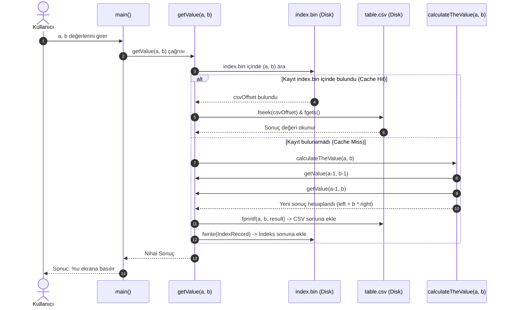

# Stirling Hesaplayıcı Yazılım İncelemesi ve Mimari Analizi

Bu belge, `Stirling Hesaplayıcı.c` kaynak kodunun matematiksel temelini, çalışma prensibini, girdi/çıktı yapısını, dinamik programlama (memoization) tekniğini ve dosya tabanlı ikili (binary) indeksleme depolama mimarisini detaylı bir şekilde incelemektedir.

---

## 1. Yazılımın Amacı ve Matematiksel Temeli

Yazılım, kombinatorikte önemli bir yere sahip olan **2. Tür Stirling Sayılarını (Stirling Numbers of the Second Kind)** hesaplamak için geliştirilmiştir.

Matematiksel gösterimi:
$$\left\{ \begin{matrix} a \\ b \end{matrix} \right\} \quad \text{veya} \quad S(a, b)$$

### Anlamı
$a$ elemanlı sonlu bir kümeyi, boş küme içermeyen **$b$ adet ayrık alt kümeye (bölüntüye / partition)** ayırmanın farklı yollarının sayısıdır.

### Rekürans (Özyineleme) Bağıntısı
Kodun temelini oluşturan matematiksel kural:
$$S(a, b) = S(a-1, b-1) + b \cdot S(a-1, b)$$

### Taban / Sınır Koşulları
Kod içerisinde uygulanan sınır değerleri:
- $b = 0$ veya $a = 0 \implies 0$ *(küme veya parça sayısı 0 ise)*
- $b > a \implies 0$ *(parça sayısı eleman sayısından büyük olamaz)*
- $b = a \implies 1$ *(her eleman tek bir alt kümede)*

---

## 2. Girdi ve Çıktı Analizi

### Girdiler (Inputs)
1. **Kullanıcı Girişi (Standart Girdi - `stdin`):**
   - `a`: Kümenin toplam eleman sayısı (`unsigned int`).
   - `b`: Ayrılmak istenen alt küme sayısı (`unsigned int`).
2. **Kalıcı Veri Deposu (Disk Girdisi):**
   - `index.bin`: Daha önce hesaplanmış $(a, b)$ çiftlerinin CSV dosyasındaki bayt ofsetlerini tutan ikili indeks kütüğü.
   - `table.csv`: Daha önce hesaplanmış değerlerin metin biçiminde saklandığı veri kütüğü.

### Çıktılar (Outputs)
1. **Kullanıcı Çıktısı (Standart Çıktı - `stdout`):**
   - `Sonuc: <değer>`: Hesaplanan veya önbellekten getirilen $S(a, b)$ sonucu (`unsigned int`).
2. **Hata Çıktısı (`stderr`):**
   - Aritmetik taşma (Integer Overflow) durumunda hata logu üretilir ve işlem sonlandırılır.
3. **Kalıcı Depolama Çıktısı (Disk Güncellemesi):**
   - Yeni hesaplanan her $(a, b, \text{result})$ üçlüsü `table.csv` sonuna metin olarak yazılır.
   - Yeni kaydın dosya konumu `index.bin` sonuna ikili struct olarak eklenir.

---

## 3. Dinamik Çalışma Sistemi (Dynamic Programming & Memoization)

Saf rekürsif hesaplama yapıldığında $S(a, b)$ çağrısı üstel ($O(2^a)$) sayıda alt çağrı oluşturur. Birçok alt problem ($S(a-1, b)$, $S(a-2, b-1)$ vb.) tekrar tekrar hesaplanır.

Bu yazılımda **Disk Tabanlı Memoization (Top-Down Dynamic Programming with Disk Caching)** yaklaşımı uygulanmıştır.



### Karşılıklı Fonksiyonel Yapı:
1. **`getValue(a, b, csvFile, idxFile)`**:
   - Önce taban durumları kontrol eder.
   - `index.bin` dosyasını baştan sona tarayarak `(a, b)` anahtarını arar.
   - **Kayıt varsa (Cache Hit):** `table.csv` dosyasına doğrudan `fseek` ile atlar, satırı okur ve sonucu döner.
   - **Kayıt yoksa (Cache Miss):** `calculateTheValue` fonksiyonunu çağırır, çıkan sonucu hem `table.csv`'ye hem `index.bin`'e yazar.
2. **`calculateTheValue(a, b, csvFile, idxFile)`**:
   - $S(a-1, b-1)$ için `getValue` çağırır (`left`).
   - $S(a-1, b)$ için `getValue` çağırır (`right`).
   - Taşıntı kontrollerini yapar.
   - `left + b * right` hesaplayarak geri döndürür.

---

## 4. Depolama ve İndeksleme Mimarisi

Sistem, ilişkisel veritabanlarının (RDBMS) temel indeksleme mantığına benzer hibrit bir depolama modeli kullanır:

```
+-------------------------------------------------------------+
|                        INDEX_FILE                           |
|                        (index.bin)                          |
|  [ a:4B | b:4B | offset:8B ] -> [ a:4B | b:4B | offset:8B ]  |
+------------------------------+------------------------------+
                               |
                               | fseek(csvFile, offset, SEEK_SET)
                               v
+-------------------------------------------------------------+
|                         CSV_FILE                            |
|                        (table.csv)                          |
|  satır 1: a,b,result                                        |
|  satır 2: 7,3,301 <--- Doğrudan okunan ofset konumu          |
+-------------------------------------------------------------+
```

### İndeks Yapısı (`IndexRecord`)
```c
typedef struct {
    unsigned int a;    // 4 byte: Küme eleman sayısı
    unsigned int b;    // 4 byte: Alt küme sayısı
    long offset;       // 4/8 byte: table.csv dosyasındaki satır başlangıç ofseti
} IndexRecord;
```

### Depolamanın Özellikleri
- **İki Katmanlı Yapı:**
  - **`table.csv`**: İnsan tarafından okunabilir, dışa aktarılabilir metin tabanlı veri deposudur.
  - **`index.bin`**: CSV içindeki satırların fiziksel bayt adreslerini tutarak tüm CSV dosyasını satır satır ayrıştırma (parsing) ihtiyacını ortadan kaldıran ikili indekstir.
- **Kalıcılık (Persistence):** Program kapatılıp tekrar çalıştırıldığında önceki oturumlarda yapılan tüm hesaplamalar korunur; sistem her çalıştığında daha hızlı hale gelir.

---

## 5. Güvenlik ve Aritmetik Taşıntı (Overflow) Kontrolü

Stirling sayıları çok hızlı büyüyen kombinatorik sayılardır. 32-bit `unsigned int` veri tipi maksimum `4,294,967,295` (`UINT_MAX`) değerini tutabilir.

Yazılım, sessiz veri bozulmalarını (silent data corruption / wraparound) engellemek için iki aşamalı tam sayı taşma koruması uygular:

1. **Çarpma Taşması Kontrolü ($b \cdot \text{right}$):**
   ```c
   if (b != 0 && right > UINT_MAX / b) {
       fprintf(stderr, "ERROR: Overflow at (%u,%u) -> %u * %u exceeds UINT_MAX\n", a, b, b, right);
       exit(EXIT_FAILURE);
   }
   ```
2. **Toplama Taşması Kontrolü ($\text{left} + \text{mult}$):**
   ```c
   if (left > UINT_MAX - mult) {
       fprintf(stderr, "ERROR: Overflow at (%u,%u) -> %u + %u exceeds UINT_MAX\n", a, b, left, mult);
       exit(EXIT_FAILURE);
   }
   ```

---

## 6. Güçlü Yönler ve Olası İyileştirme Önerileri

### Güçlü Yönler:
- **Akıllı Önbellekleme:** Disk tabanlı memoization sayesinde aynı hesaplamalar tekrar yapılmaz.
- **Doğrudan Erişim:** CSV satırına `fseek` ile ofset üzerinden atlanarak metin ayrıştırma maliyeti düşürülmüştür.
- **Güvenli Aritmetik:** Taşıntı kontrolleriyle hatalı hesaplamanın önüne geçilmiştir.

### Geliştirilebilecek Alanlar:
1. **İndeks Arama Hızı ($O(N)$ Doğrusal Arama):**
   - Şu an `index.bin` dosyası her aramada baştan sona `fread` ile okunmaktadır.
   - *Öneri:* İndeks RAM'e bir Hash Tablosu (Hash Map) veya İkili Arama Ağacı (B-Tree/Red-Black Tree) olarak yüklenebilir ($O(1)$ veya $O(\log N)$ erişim).
2. **Sayı Kapasitesi (Büyük Sayı Desteği):**
   - `unsigned int` (32-bit) yerine `unsigned long long` (64-bit) veya `GMP` (GNU Multiple Precision Arithmetic Library) kullanılarak çok daha büyük $a, b$ değerleri hesaplanabilir.
3. **Dosya İşleyici Yönetimi (File Descriptor Overhead):**
   - `main` döngüsü içinde her adımda `fopen` / `fclose` yapılmaktadır. Sürekli açık tutularak disk I/O gecikmesi azaltılabilir.
