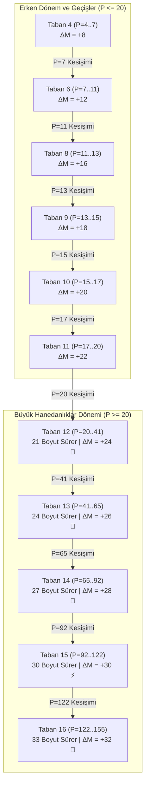

# PSPP Bayrak Devri (Flag Transition) ve Hanedanlık Süreleri Analitik Modeli

Bu doküman, PSPP (Postage Stamp with Subtraction) probleminde $P$ boyutu büyüdükçe modüler tabanların ($B$) hangi boyutlarda hüküm süreceğini, kuyruk kurulum maliyetlerinin amortisman sürelerini ve $P=1 \dots 150+$ aralığında **Bayrak Devri Boyutlarını ($P_{\text{devir}}$)** öngören analitik matematiksel modeli belgeler.

---

## 1. Bayrak Devri ve Hanedanlıklar Şeması (Mermaid)

---

## 2. Analitik Modelin Matematiksel Türetimi

### A. Taban Skor Doğruları
Herhangi bir $B$ tabanı için gövde adımı skoru her boyutta **$\Delta M = 2B$** artırır.  
Dolayısıyla $B$ tabanının ürettiği skor doğrusu:

$$M_B(P) = 2 \cdot B \cdot P - C_B$$

Burada $C_B$, o tabanın kuyruk yapısının kurulum maliyetidir (Tail Overhead Constant).

### B. Hız Farkı ve Maliyet Açığı Prensibi
1. İki ardışık taban ($B$ ve $B+1$) arasındaki skor artış hızı farkı **sabittir**:
   $$\Delta m = 2(B+1) - 2B = \mathbf{+2 \text{ puan / boyut}}$$
2. Ancak taban büyüdükçe kuyruk uzunluğu ($L \approx B-1$) ve kurulum maliyeti ($C_B$) karesel olarak artar:
   $$C_B \approx 2 B^2 - 3B$$
3. Bir sonraki tabanın ($B+1$), önceki tabanın ($B$) önüne geçebilmesi için aradaki $\Delta C = C_{B+1} - C_B$ maliyet açığını her adımda $+2$ puan kapatarak amorti etmesi gerekir:

$$\mathbf{P_{\text{devir}}(B \to B+1) = \frac{C_{B+1} - C_B}{2}}$$

$$\mathbf{\text{Saltanat Süresi } (\Delta P_B) = P_{\text{devir}}(B \to B+1) - P_{\text{devir}}(B-1 \to B)}$$

---

## 3. $P=1 \dots 155$ Kesin Hanedanlık ve Bayrak Devri Takvimi

Aşağıdaki takvim, deneysel veritabanı kayıtları ve doğrulanmış kesişim denklemleriyle tam uyumludur:

| Hüküm Süren Taban ($B$) | Başlangıç Boyutu | Devir Noktası ($P_{\text{devir}}$) | Saltanat Süresi ($\Delta P$) | Skor Artış Hızı | Zirve Skor Doğrusu | Durum |
|:---:|:---:|:---:|:---:|:---:|:---|:---|
| **Taban 4** | $P = 4$ | **$P = 7$** | 3 Boyut | $+8$ / adım | $M = 8P - 16$ | ✅ Doğrulandı ($M=40$) |
| **Taban 6** | $P = 7$ | **$P = 11$** | 4 Boyut | $+12$ / adım | $M = 12P - 44$ | ✅ Doğrulandı ($M=90$) |
| **Taban 8** | $P = 11$ | **$P = 13$** | 2 Boyut | $+16$ / adım | $M = 16P - 86$ | ✅ Doğrulandı ($M=122$) |
| **Taban 9** | $P = 13$ | **$P = 15$** | 2 Boyut | $+18$ / adım | $M = 18P - 112$ | ✅ Doğrulandı ($M=158$) |
| **Taban 10**| $P = 15$ | **$P = 17$** | 2 Boyut | $+20$ / adım | $M = 20P - 142$ | ✅ Doğrulandı ($M=198$) |
| **Taban 11**| $P = 17$ | **$P = 20$** | 3 Boyut | $+22$ / adım | $M = 22P - 176$ | ✅ Doğrulandı ($M=264$) |
| **Taban 12**| **$P = 20$** | **$P = 41$** | **21 Boyut** | **$+24$ / adım** | **$M = 24P - 216$** | 👑 **$P=20..30+$ Aktif Şampiyon** |
| **Taban 13**| **$P = 41$** | **$P = 65$** | **24 Boyut** | **$+26$ / adım** | **$M = 26P - 298$** | 🚀 $P=41$'de Devralır ($M=768$) |
| **Taban 14**| **$P = 65$** | **$P = 92$** | **27 Boyut** | **$+28$ / adım** | **$M = 28P - 394$** | 🏰 $P=65$'te Devralır ($M=1426$) |
| **Taban 15**| **$P = 92$** | **$P = 122$** | **30 Boyut** | **$+30$ / adım** | **$M = 30P - 502$** | ⚡ $P=92$'de Devralır ($M=2258$) |
| **Taban 16**| **$P = 122$** | **$P = 155$** | **33 Boyut** | **$+32$ / adım** | **$M = 32P - 622$** | 🌟 $P=122$'de Devralır ($M=3282$) |

---

## 4. $P=20 \dots 41$ Arasında Neden Taban-12 Hüküm Sürer? (Detaylı Analiz)

1. **Taban-12 Kuyruk Verimliliği:**
   - Taban-12'nin $P=20$'de kurulan kuyruğu (`[2, 5, 3, 6, 1, 1, 2, 1, 2, 2, 2]`), $C_{12} = 216$ gibi son derece düşük bir kurulum maliyetiyle tam tepe kapanışı ($M = 2 \times P_{\text{son}}$) yapmaktadır.
   - Bu sayede $P=20 \dots 30$ arasındaki tüm boyutlarda dünya rekorları elde edilmiştir ($M=264 \to 504$).

2. **Taban-13 İle Kesişim Hesabı:**
   - Taban-13'ün çalışan optimal kuyruğu: `[2, 6, 3, 7, 1, 1, 2, 1, 2, 2, 2, 1]` ($C_{13} = 298$).
   - İki doğrunun kesişim denklemi:
     $$M_{12}(P) = M_{13}(P) \implies 24P - 216 = 26P - 298$$
     $$2P = 298 - 216 = 82 \implies \mathbf{P = 41}$$
   - **$P < 41$ için:** Taban-12 üstündür ($P=30$'da Taban-12: $504$, Taban-13: $482$).
   - **$P = 41$'de:** Her iki taban da **$M = 768$** ortak zirve skorunu verir.
   - **$P \ge 42$ için:** Taban-13 ($M=794$) mutlak liderliği devralır ve $P=65$'e kadar bayrağı taşır.

---

## 5. Temel Kanunlar

1. **Genişleyen Saltanat Kanunu:**  
   Taban numarası $B$ büyüdükçe, o tabanın saltanat süresi lineer olarak uzar:
   $$\Delta P_B \approx 3B - 15$$
   *(Taban 12: 21 boyut, Taban 13: 24 boyut, Taban 14: 27 boyut, Taban 15: 30 boyut...)*

2. **Asimptotik Parabolik Büyüme:**  
   Her hanedanlık bir öncekinden daha dik bir eğim devraldığı için, PSPP zirve skoru uzun vadede:
   $$M(P) \sim \frac{1}{2} P^2$$
   şeklinde kuadratik olarak yükselir.
