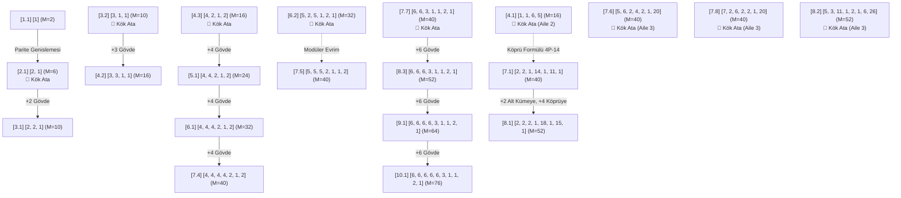

# PSPP Dizi Soy Ağacı ve Kök Ata Analizi ($P = 1 \dots 10$)

Bu doküman, PSPP (Postage Stamp with Subtraction / Para Sayma Problemi) probleminde $P=1$'den $P=10$'a kadar tespit edilen **tüm optimum ve alternatif çözümlerin (toplam 23 çözüm)** genetik soy ağacını (lineage), ebeveyn-çocuk ($P \to P+1$) ilişkilerini ve hangi dizilerin **"Özgün Kök Ata (Root Ancestor)"**, hangi dizilerin ise **"Türemiş Çocuk (Descendant)"** olduğunu matematiksel olarak belgeler.

---

## 1. Soy Ağacı Genel Görsel Şeması (Mermaid Lineage Graph)

---

## 2. Soy Hatları (Lineages) ve Genetik Sınıflandırma

$P=1 \dots 10$ aralığındaki 23 optimum çözüm, 7 temel soy hattında kümelenir:

---

### 🧬 HAT 1: Taban-4 Modüler Ana Omurga Hattı (Safe Area'nın En Uzun Nesli)
* **Karakteristiği:** Sabit periyot $d_0 = 4$, kuyruk `[2, 1, 2]`, tepe kapanış $M = 2 \times P_{\text{son}}$.
* **Kök Ata:** `[4, 2, 1, 2]` ($P=4, M=16$)
* **Nesil Ağacı:**
  1. **$P=4$ (Ata):** `[4, 2, 1, 2]` $\implies M = 16$
  2. **$P=5$ (1. Nesil Çocuk):** `[4, 4, 2, 1, 2]` $\implies M = 24$ *(Başa bir adet 4 adımı eklenmiştir)*
  3. **$P=6$ (2. Nesil Torun):** `[4, 4, 4, 2, 1, 2]` $\implies M = 32$ *(Gövdeye bir adet 4 adımı eklenmiştir)*
  4. **$P=7$ (3. Nesil Torun):** `[4, 4, 4, 4, 2, 1, 2]` $\implies M = 40$ *(Gövdeye bir adet 4 adımı eklenmiştir)*

---

### 🧬 HAT 2: Taban-6 Modüler İmparatorluk Hattı ($P \ge 7$'den $P=10+$'a Büyüyen Hat)
* **Karakteristiği:** Sabit periyot $d_0 = 6$, kuyruk `[3, 1, 1, 2, 1]`, tepe kapanış $M = 2 \times P_{\text{son}}$.
* **Kök Ata:** `[6, 6, 3, 1, 1, 2, 1]` ($P=7, M=40$)
* **Nesil Ağacı:**
  1. **$P=7$ (Ata):** `[6, 6, 3, 1, 1, 2, 1]` $\implies M = 40$
  2. **$P=8$ (1. Nesil Çocuk):** `[6, 6, 6, 3, 1, 1, 2, 1]` $\implies M = 52$ *(Başa bir adet 6 adımı eklenmiştir)*
  3. **$P=9$ (2. Nesil Torun):** `[6, 6, 6, 6, 3, 1, 1, 2, 1]` $\implies M = 64$ *(Gövdeye bir adet 6 adımı eklenmiştir)*
  4. **$P=10$ (3. Nesil Torun):** `[6, 6, 6, 6, 6, 3, 1, 1, 2, 1]` $\implies M = 76$ *(Gövdeye bir adet 6 adımı eklenmiştir)*

---

### 🧬 HAT 3: Aile 2 — Bipartite Çift Kümeli Köprü Soy Hattı
* **Karakteristiği:** Alt küme $C_1$, büyük köprü adımı $\delta_{\text{bridge}} = 4P - 14$, üst küme $C_2$.
* **Kök Ata:** `[1, 1, 6, 5]` ($P=4, M=16$)
* **Nesil Ağacı:**
  1. **$P=4$ (Prototip Ata):** `[1, 1, 6, 5]` $\implies M = 16$
  2. **$P=7$ (Evrimleşmiş Çocuk):** `[2, 2, 1, 14, 1, 11, 1]` $\implies M = 40$ *(Köprü = $4(7)-14 = 14$)*
  3. **$P=8$ (Doğrudan Çocuk):** `[2, 2, 2, 1, 18, 1, 15, 1]` $\implies M = 52$ *(Alt kümeye +2, Köprü = $18$, Üst boşluk $11 \to 15$)*

---

### 🧬 HAT 4: Aile 3 — Asimetrik Uç Sıçraması Soy Hattı (Leapfrog)
* **Karakteristiği:** $\delta_{\text{son}} = M/2$, dizi toplamı $P_{\text{son}} = M$.
* **Kök Atalar / Bağımsız Mutasyonlar:**
  1. **$P=7$ Kök Ata A:** `[5, 6, 2, 4, 2, 1, 20]` $\implies M = 40$
  2. **$P=7$ Kök Ata B:** `[7, 2, 6, 2, 2, 1, 20]` $\implies M = 40$
  3. **$P=8$ Kök Ata C:** `[5, 3, 11, 1, 2, 1, 6, 26]` $\implies M = 52$

---

### 🧬 HAT 5: Erken Sıçramalı Hibrit Modülerler
* **Karakteristiği:** İlk adımda büyük sıçrama barındıran asimetrik Aile 1 varyasyonları.
* **Kök Atalar:**
  1. **$P=7$ Kök Ata A:** `[2, 9, 2, 1, 4, 1, 2]` $\implies M = 40$
  2. **$P=7$ Kök Ata B:** `[2, 11, 1, 2, 1, 5, 1]` $\implies M = 40$

---

### 🧬 HAT 6 & 7: Küçük Boyut Kök Hatları (Taban-2 ve Taban-3)
* **Taban-2 Hattı:** `[2, 1]` ($P=2, M=6$) $\xrightarrow{+2}$ `[2, 2, 1]` ($P=3, M=10$).
* **Taban-3 Hattı:** `[3, 1, 1]` ($P=3, M=10$) $\xrightarrow{+3}$ `[3, 3, 1, 1]` ($P=4, M=16$).

---

## 3. $P=1 \dots 10$ Tüm Alternatif Çözümler Detaylı Kimlik Tablosu

| Boyut | No | Delta Dizisi ($\delta$) | Skor ($M$) | Tip / Durum | Ebeveyni (Kimin Çocuğu?) | Nasıl Doğdu? (Türetim Mekanizması) |
|:---:|:---:|:---|:---:|:---:|:---|:---|
| **$P=1$** | 1 | `[1]` | 2 | **🌱 KÖK ATA** | - | Evrenin ilk tohumu |
| **$P=2$** | 1 | `[2, 1]` | 6 | **🌱 KÖK ATA** | `[1]` | Parite ve tekillik genişlemesi |
| **$P=3$** | 1 | `[2, 2, 1]` | 10 | **👶 ÇOCUK** | $P=2$ `[2, 1]` | Başa `+2` gövde adımı ekleme |
| **$P=3$** | 2 | `[3, 1, 1]` | 10 | **🌱 KÖK ATA** | - | Taban-3 periyodunun ilk atası |
| **$P=4$** | 1 | `[1, 1, 6, 5]` | 16 | **🌱 KÖK ATA** | - | Aile 2 (Bipartite Köprü) ilk atası |
| **$P=4$** | 2 | `[3, 3, 1, 1]` | 16 | **👶 ÇOCUK** | $P=3$ `[3, 1, 1]` | Başa `+3` gövde adımı ekleme |
| **$P=4$** | 3 | `[4, 2, 1, 2]` | 16 | **🌱 KÖK ATA** | - | Taban-4 ve `[2,1,2]` kuyruğunun ilk atası |
| **$P=5$** | 1 | `[4, 4, 2, 1, 2]` | 24 | **👶 ÇOCUK** | $P=4$ `[4, 2, 1, 2]` | Başa `+4` gövde adımı ekleme |
| **$P=6$** | 1 | `[4, 4, 4, 2, 1, 2]` | 32 | **👶 ÇOCUK** | $P=5$ `[4, 4, 2, 1, 2]` | Gövdeye `+4` adımı ekleme |
| **$P=6$** | 2 | `[5, 2, 5, 1, 2, 1]` | 32 | **🌱 KÖK ATA** | - | Taban-5 hibrit periyot başlangıcı |
| **$P=7$** | 1 | `[2, 2, 1, 14, 1, 11, 1]` | 40 | **👶 ÇOCUK** | $P=4$ `[1, 1, 6, 5]` | Aile 2 formülü ($\delta_{\text{bridge}}=14$) |
| **$P=7$** | 2 | `[2, 9, 2, 1, 4, 1, 2]` | 40 | **🌱 KÖK ATA** | - | Erken sıçramalı özgün hibrit |
| **$P=7$** | 3 | `[2, 11, 1, 2, 1, 5, 1]` | 40 | **🌱 KÖK ATA** | - | Erken sıçramalı özgün hibrit |
| **$P=7$** | 4 | `[4, 4, 4, 4, 2, 1, 2]` | 40 | **👶 ÇOCUK** | $P=6$ `[4, 4, 4, 2, 1, 2]` | Gövdeye `+4` adımı ekleme |
| **$P=7$** | 5 | `[5, 5, 5, 2, 1, 1, 2]` | 40 | **🌱 KÖK ATA** | $P=6$ `[5, 2, 5, 1, 2, 1]` | Taban-5 tam modüler gövde evrimi |
| **$P=7$** | 6 | `[5, 6, 2, 4, 2, 1, 20]` | 40 | **🌱 KÖK ATA** | - | Aile 3 Uç Sıçraması ($\delta_{\text{son}}=20$) |
| **$P=7$** | 7 | `[6, 6, 3, 1, 1, 2, 1]` | 40 | **🌱 KÖK ATA** | - | Taban-6 ve `[3,1,1,2,1]` kuyruk atası |
| **$P=7$** | 8 | `[7, 2, 6, 2, 2, 1, 20]` | 40 | **🌱 KÖK ATA** | - | Aile 3 Uç Sıçraması ($\delta_{\text{son}}=20$) |
| **$P=8$** | 1 | `[2, 2, 2, 1, 18, 1, 15, 1]` | 52 | **👶 ÇOCUK** | $P=7$ `[2, 2, 1, 14, 1, 11, 1]` | Alt kümeye `+2`, Köprü $14 \to 18$ |
| **$P=8$** | 2 | `[5, 3, 11, 1, 2, 1, 6, 26]` | 52 | **🌱 KÖK ATA** | - | Aile 3 Uç Sıçraması ($\delta_{\text{son}}=26$) |
| **$P=8$** | 3 | `[6, 6, 6, 3, 1, 1, 2, 1]` | 52 | **👶 ÇOCUK** | $P=7$ `[6, 6, 3, 1, 1, 2, 1]` | Başa `+6` gövde adımı ekleme |
| **$P=9$** | 1 | `[6, 6, 6, 6, 3, 1, 1, 2, 1]` | 64 | **👶 ÇOCUK** | $P=8$ `[6, 6, 6, 3, 1, 1, 2, 1]` | Gövdeye `+6` adımı ekleme |
| **$P=10$**| 1 | `[6, 6, 6, 6, 6, 3, 1, 1, 2, 1]`| 76 | **👶 ÇOCUK** | $P=9$ `[6, 6, 6, 6, 3, 1, 1, 2, 1]`| Gövdeye `+6` adımı ekleme |

---

## 4. İstatistiki Özet ve Çıkarımlar

1. **Özgün Kök Ata Oranı:**
   - $P=1 \dots 10$ arasındaki 23 çözümün **12 adedi (%52)** "Özgün Kök Ata (Root Ancestor)" niteliğindedir.
   - **11 adedi (%48)** ise önceki boyuttaki bir ebeveynin doğrudan gövde/köprü büyümesi ile doğmuş "Çocuk (Descendant)" dizilerdir.

2. **$P=7$ Zirvesi ve Çeşitlilik Patlaması:**
   - $P=7$, tarihteki en yüksek morfolojik çeşitliliğe sahiptir (8 farklı çözüm).
   - Bu 8 çözümün 5'i özgün kök tohumken, 3'ü önceki boyutlardan ($P=4$ ve $P=6$) türemiştir.

3. **$P \ge 8$'den İtibaren Modüler Hakimiyet:**
   - $P=8$'den sonra çeşitlilik hızla daralır; $P=9$ ve $P=10$'da **yalnızca $P=7$'deki 6'lı kök atanın (`[6, 6, 3, 1, 1, 2, 1]`) doğrudan çocukları** küresel tek optimum olarak hayatta kalır.
