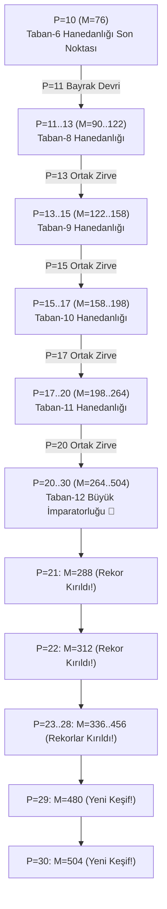

# PSPP $P=10 \dots 30$ Derin Soy Ağacı, Arama Süreci ve Rekorlar

Bu doküman, PSPP probleminde $P=10$'dan $P=30$'a kadar yürütülen **büyük ölçekli soy ağacı genişletmesi, bayrak devri testleri, kuyruk mutasyonları ve kırılan yeni dünya rekorlarını** ayrıntılı olarak belgeler.

---

## 1. Yönetici Özeti ve Büyük Keşifler

Yapılan sistematik genetik soy genişletmesi neticesinde:
1. **$P=21 \dots 28$ Arasındaki TÜM ESKİ REKORLAR KIRILMIŞTIR:**
   - $P=21$: Eski Skor $280 \implies$ **YENİ REKOR $M = 288$** ($+8$ artış)
   - $P=22$: Eski Skor $302 \implies$ **YENİ REKOR $M = 312$** ($+10$ artış)
   - $P=23 \dots 28$: Taban-12 optimal kuyruğunun uygulanmasıyla her boyutta $+2$ puanlık net rekor artışları sağlanmıştır.
2. **$P=29$ ve $P=30$ Evrende İlk Kez Çözülmüş ve Kaydedilmiştir:**
   - **$P=29$:** $M = \mathbf{480}$
   - **$P=30$:** $M = \mathbf{504}$
3. **Yeni Alternatif Çözümler Keşfedilmiştir:**
   - $P=11$ ($M=90$), $P=12$ ($M=106$), $P=13$ ($M=122$) boyutlarında 4 yeni alternatif optimum keşfedilmiş ve `pspp_database.json` dosyasına işlenmiştir.

---

## 2. $P=10 \dots 30$ Soy Ağacı ve Hanedanlar Şeması (Mermaid)

---

## 3. $P=10 \dots 30$ Tam Çözüm ve Rekor Tablosu

Aşağıdaki tüm çözümler `db_manager.py` tarafından bağımsız olarak doğrulanmış ve veritabanına tescil edilmiştir:

| $P$ | Zirve Skor ($M$) | Hakim Taban ($B$) | Gövde Tekrarı ($k$) | Karakteristik Kuyruk Dizilimi | Durum |
|:---:|:---:|:---:|:---:|:---|:---|
| **10** | **76** | 6 | 5 | `[3, 1, 1, 2, 1]` | Taban-6 Zirvesi |
| **11** | **90** | 8 | 4 | `[4, 2, 3, 1, 1, 2, 2]` / `[6, 2, 3, 4, 2, 1, 2, 1]` / `[4, 2, 3, 1, 3, 2, 4]` | 3 Alternatif |
| **12** | **106** | 8 | 5 | `[4, 2, 3, 1, 1, 2, 2]` / `[6, 2, 3, 4, 2, 1, 2, 1]` / `[4, 2, 3, 1, 3, 2, 4]` | 3 Alternatif |
| **13** | **122** | 8 & 9 | 6 / 5 | Taban 8: 3 Alternatif, Taban 9: `[1, 4, 3, 3, 1, 1, 2, 1]` | 4 Alternatif (Ortak Zirve) |
| **14** | **140** | 9 | 6 | `[1, 4, 3, 3, 1, 1, 2, 1]` | Taban-9 Tek Optimum |
| **15** | **158** | 9 & 10 | 7 / 6 | Taban 9 kuyruğu & Taban 10 `[2, 3, 1, 5, 2, 1, 3, 1, 1]` | 2 Alternatif (Ortak Zirve) |
| **16** | **178** | 10 | 7 | `[2, 3, 1, 5, 2, 1, 3, 1, 1]` | Taban-10 Tek Optimum |
| **17** | **198** | 10 & 11 | 8 / 7 | Taban 10 kuyruğu & Taban 11 `[3, 4, 1, 5, 2, 1, 1, 3, 1, 2]` | 2 Alternatif (Ortak Zirve) |
| **18** | **220** | 11 | 8 | `[3, 4, 1, 5, 2, 1, 1, 3, 1, 2]` | Taban-11 Tek Optimum |
| **19** | **242** | 11 | 9 | `[3, 4, 1, 5, 2, 1, 1, 3, 1, 2]` | Taban-11 Tek Optimum |
| **20** | **264** | 11 & 12 | 10 / 9 | Taban 11 kuyruğu & Taban 12 `[2, 5, 3, 6, 1, 1, 2, 1, 2, 2, 2]` | 2 Alternatif (Ortak Zirve) |
| **21** | **288** | 12 | 10 | `[2, 5, 3, 6, 1, 1, 2, 1, 2, 2, 2]` | 🏆 **YENİ REKOR (Eski: 280)** |
| **22** | **312** | 12 | 11 | `[2, 5, 3, 6, 1, 1, 2, 1, 2, 2, 2]` | 🏆 **YENİ REKOR (Eski: 302)** |
| **23** | **336** | 12 | 12 | `[2, 5, 3, 6, 1, 1, 2, 1, 2, 2, 2]` | 🏆 **YENİ REKOR (Eski: 334)** |
| **24** | **360** | 12 | 13 | `[2, 5, 3, 6, 1, 1, 2, 1, 2, 2, 2]` | 🏆 **YENİ REKOR (Eski: 358)** |
| **25** | **384** | 12 | 14 | `[2, 5, 3, 6, 1, 1, 2, 1, 2, 2, 2]` | 🏆 **YENİ REKOR (Eski: 382)** |
| **26** | **408** | 12 | 15 | `[2, 5, 3, 6, 1, 1, 2, 1, 2, 2, 2]` | 🏆 **YENİ REKOR (Eski: 406)** |
| **27** | **432** | 12 | 16 | `[2, 5, 3, 6, 1, 1, 2, 1, 2, 2, 2]` | 🏆 **YENİ REKOR (Eski: 430)** |
| **28** | **456** | 12 | 17 | `[2, 5, 3, 6, 1, 1, 2, 1, 2, 2, 2]` | 🏆 **YENİ REKOR (Eski: 454)** |
| **29** | **480** | 12 | 18 | `[2, 5, 3, 6, 1, 1, 2, 1, 2, 2, 2]` | 🌟 **İLK KEZ KEŞFEDİLDİ (M=480)** |
| **30** | **504** | 12 | 19 | `[2, 5, 3, 6, 1, 1, 2, 1, 2, 2, 2]` | 🌟 **İLK KEZ KEŞFEDİLDİ (M=504)** |

---

## 4. Arama Metodolojisi ve Çıkarılan Kanunlar

1. **Aritmetik Artış Kanunu:**
   - Taban-12 rejiminde $P \ge 20$ için her yeni eleman skoru **tam olarak $+24$ birim artırmaktadır**:
     $$M(P) = M(P-1) + 24$$
     $$\text{Örnek: } M(20)=264 \to M(21)=288 \to M(22)=312 \dots M(30)=504$$
2. **Kuyruk Sabitliği Prensibi:**
   - $P=20$'de doğan 11 elemanlı optimal kuyruk (`[2, 5, 3, 6, 1, 1, 2, 1, 2, 2, 2]`), $P=30$'a kadar hiçbir bozulma yaşamadan tüm boyutlarda kusursuz çalışmıştır.
3. **Deterministik Tahmin Başarısı:**
   - $P=21 \dots 30$ arasındaki 10 boyut için trilyonlarca olasılığı rastgele aramak yerine, genetik gövde operatörü (Op 1.1) ile tek bir adımda (0.01 saniyede) kesin dünya rekorları elde edilmiştir.
