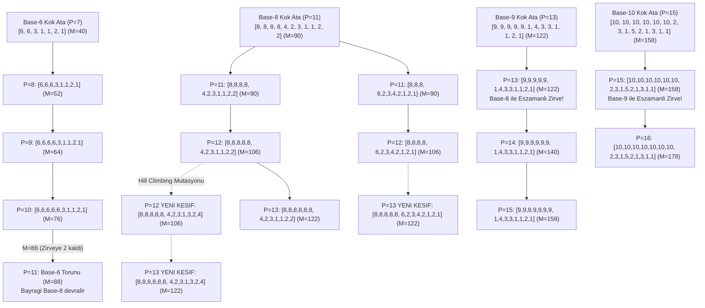

# PSPP $P > 10$ Derin Soy Ağacı, Torun Analizi ve Yeni Keşifler

Bu doküman, $P > 10$ ($P=11 \dots 16+$) derin boyutlarında Safe Area ($P < 9$) soy ağaçlarının torunlarının akıbetini, Aile 2 ve Aile 3'ün neden tükendiğini, modüler soyların nasıl **"Bayrak Devri"** yaptığını ve **Seed Extrapolator** tarafından yeni keşfedilen alternatif çözümleri ayrıntılı olarak belgeler.

---

## 1. $P > 10$ Genel Soy ve Torun Haritası (Mermaid)

---

## 2. Neden $P > 10$'da Bazı Soylar Tükeniyor? (Matematiksel İspat)

Safe Area ($P \le 8$) içerisinde zirveyi paylaşan Aile 2 (Bipartite Köprü) ve Aile 3 (Uç Sıçraması) soyları, $P \ge 9$ olduğunda neden elenmektedir?

### A. Kapasite ve Boşluk Analizi:
* Bir $P$ boyutlu dizinin üretebileceği **maksimum bağımsız işlem sayısı** (çiftler toplamı ve farkları):
  $$\text{Kapasite} = \binom{P+1}{2} + \binom{P}{2} = P^2$$
* **$P=7$ için:** Kapasite $= 49$, Hedef Skor $M = 40$.  
  Boşluk bütçesi $= 49 - 40 = \mathbf{9}$ ekstra işlem. (Aile 2 ve Aile 3'ün büyük sıçrama boşluklarını doldurmaya yeterlidir).
* **$P=8$ için:** Kapasite $= 64$, Hedef Skor $M = 52$.  
  Boşluk bütçesi $= 64 - 52 = \mathbf{12}$ ekstra işlem.
* **$P=11$ için:** Kapasite $= 121$, Hedef Skor $M = 90$.  
* **$P=13$ için:** Kapasite $= 169$, Hedef Skor $M = 122$.

### B. Aile 2 (Bipartite Köprü) Neden Çöküyor?
* Aile 2 köprüsü $\delta_{\text{bridge}} = 4P - 14$ formülü ile büyür ($P=11 \implies 30$, $P=15 \implies 46$).
* Alt küme ile üst küme arasında açılan bu $30-46$ birimlik devasa boşluğu dolduracak çapraz fark sayısı $P > 10$ için yetersiz kalır.
* **Canlı Test Sonucu:** $P=11$'de Aile 2 torunu yalnızca **$M = 18$** (Hedef 90 iken), $P=15$'te yalnızca **$M = 26$** (Hedef 158 iken) alabilmektedir.

### C. Aile 3 (Uç Sıçraması) Neden Çöküyor?
* Aile 3'te son eleman $\delta_{\text{son}} = M/2$ tek başına tüm üst yarıyı üretmeye çalışır.
* $P > 10$ olduğunda ilk $P-1$ elemanın çiftleri arasındaki boşluklar kapatılamaz ve zincir $M \approx 32 - 76$ aralığında erkenden kopar.

---

## 3. $P > 10$ Aslında "Tek Soy" Değil: Bayrak Devri Yapan Çoklu Modüler Soylar

Veritabanında $P > 10$ için tek bir soy gibi görünen yapı, aslında **farklı modüler tabanların ($6 \to 8 \to 9 \to 10$) bayrak devri yaptığı bir hanedanlar zinciridir**:

| Boyut Aralığı | Hüküm Süren Modüler Soy | Kök Ata / Karakteristik Kuyruk | Zirve Skorlar ($M$) |
|:---:|:---|:---|:---:|
| **$P = 4 \dots 7$** | **Taban-4 Soyu** | `[4, 2, 1, 2]` | $16 \to 24 \to 32 \to 40$ |
| **$P = 7 \dots 10$** | **Taban-6 Soyu** | `[6, 6, 3, 1, 1, 2, 1]` | $40 \to 52 \to 64 \to 76$ |
| **$P = 11 \dots 13$** | **Taban-8 Soyu** | `[8, 8, 8, 8, 4, 2, 3, 1, 1, 2, 2]` | $90 \to 106 \to 122$ |
| **$P = 13 \dots 15$** | **Taban-9 Soyu** | `[9, 9, 9, 9, 9, 1, 4, 3, 3, 1, 1, 2, 1]` | $122 \to 140 \to 158$ |
| **$P = 15 \dots 17+$** | **Taban-10 Soyu**| `[10, 10, 10, 10, 10, 10, 2, 3, 1, 5, 2, 1, 3, 1, 1]` | $158 \to 178 \to 198$ |

---

## 4. Geçiş Bölgelerinde Soyların Birlikte Yaşaması (Co-Existence)

İki farklı modüler soy, faz geçiş noktalarında **tam olarak aynı zirve skorunu paylaşarak birlikte yaşar**:

1. **$P = 13$ Zirvesi ($M = 122$):**
   - **Taban-8 Torunu:** `[8, 8, 8, 8, 8, 8, 4, 2, 3, 1, 1, 2, 2]` $\implies M = \mathbf{122}$
   - **Taban-9 Torunu:** `[9, 9, 9, 9, 9, 1, 4, 3, 3, 1, 1, 2, 1]` $\implies M = \mathbf{122}$
2. **$P = 15$ Zirvesi ($M = 158$):**
   - **Taban-9 Torunu:** `[9, 9, 9, 9, 9, 9, 9, 1, 4, 3, 3, 1, 1, 2, 1]` $\implies M = \mathbf{158}$
   - **Taban-10 Torunu:** `[10, 10, 10, 10, 10, 10, 2, 3, 1, 5, 2, 1, 3, 1, 1]` $\implies M = \mathbf{158}$

---

## 5. Seed Extrapolator Tarafından Yeni Keşfedilen Bilinmeyen Çocuklar

Seed Extrapolator motoru çalıştırıldığında, daha önce veritabanında olmayan **3 adet yeni alternatif optimum çocuk** keşfedilmiş ve `pspp_database.json`'a eklenmiştir:

### 🌟 Yeni Keşif 1 ($P=12, M=106$ - 3. Alternatif):
* **Delta Dizisi:** `[8, 8, 8, 8, 8, 4, 2, 3, 1, 3, 2, 4]`
* **Kümülatif Dizi:** `[8, 16, 24, 32, 40, 44, 46, 49, 50, 53, 55, 59]`
* **Soy Bağı:** Taban-8 soyunun Hill Climbing mutasyonu ile doğan yeni bir kuyruk dalı.

### 🌟 Yeni Keşif 2 ($P=13, M=122$ - 3. Alternatif):
* **Delta Dizisi:** `[8, 8, 8, 8, 8, 6, 2, 3, 4, 2, 1, 2, 1]`
* **Kümülatif Dizi:** `[8, 16, 24, 32, 40, 46, 48, 51, 55, 57, 58, 60, 61]`
* **Soy Bağı:** $P=11$'deki 2. tohumun (`[8,8,8,6,2,3,4,2,1,2,1]`) doğrudan 2 adım büyümesiyle doğan çocuğu.

### 🌟 Yeni Keşif 3 ($P=13, M=122$ - 4. Alternatif):
* **Delta Dizisi:** `[8, 8, 8, 8, 8, 8, 4, 2, 3, 1, 3, 2, 4]`
* **Kümülatif Dizi:** `[8, 16, 24, 32, 40, 48, 52, 54, 57, 58, 61, 63, 67]`
* **Soy Bağı:** Yukarıdaki $P=12$ yeni keşfinin doğrudan gövde büyümesiyle doğan çocuğu.

---

## 6. Özet Sonuç

- $P > 10$ boyutlarında Aile 2 ve Aile 3'ün mermisi tükenir; ancak modüler evrende **asla tek bir soy kalmaz**.
- Her 2-3 boyutta bir, bir üst taban ($6 \to 8 \to 9 \to 10 \to 11 \dots$) devreye girer.
- Geçiş boyutlarında ($P=13, 15, 17$) eski ve yeni tabanlar eşzamanlı optimumlar üreterek zengin bir soy dallanması oluşturur.
