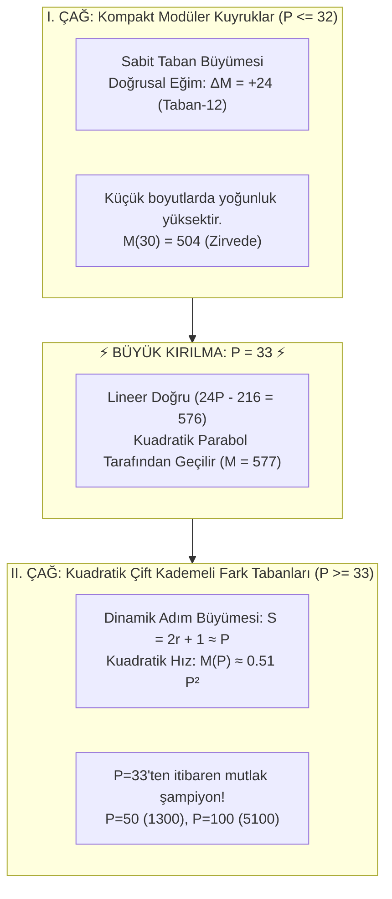

# PSPP $P=32 \to P=33$ Büyük Kırılma Noktası ve Kuadratik Çağ Raporu

Bu doküman, PSPP probleminde sabit modüler tabanlı gövdelerin (Taban-4, 6, 8, 10, 12, 13) neden **$P=32 \to P=33$ sınırından sonra zirvede tutunamadığını**, ortaya çıkan **Faz Değişimini (Phase Transition)** ve kuadratik fark tabanlarının getirdiği yeni zirve sonuçlarını belgeler.

---

## 1. Büyük Kırılma ve Paradigma Değişimi (Mermaid)

---

## 2. $P=30 \dots 35$ Arasında Kafa Kafaya Yarış ve Kesişim

Aşağıdaki tablo, sabit tabanlı Taban-12 ailesi ile dinamik çift kademeli kuadratik fark yapısının $P=30 \dots 35$ aralığındaki tam yarışını göstermektedir:

| Boyut ($P$) | Taban-12 Skoru ($M_{12} = 24P - 216$) | Kuadratik Fark Skoru ($M_{\text{quad}} = s(2r+1)+r$) | Zirve Sahibi (Kazanan) | Fark / Durum |
|:---:|:---:|:---:|:---:|:---|
| **$P = 30$** | **504** | 480 | 👑 **Taban-12** | Taban-12 $+24$ puan önde |
| **$P = 31$** | **528** | 511 | 👑 **Taban-12** | Taban-12 $+17$ puan önde |
| **$P = 32$** | **552** | 544 | 👑 **Taban-12** *(Son Zafer)* | Taban-12 $+8$ puan önde |
| **$P = 33$** | 576 | **577** | 🚀 **Kuadratik Temel** | **⚡ Faz Değişimi (+1 Puanla Geçti!)** |
| **$P = 34$** | 600 | **612** | 🚀 **Kuadratik Temel** | Kuadratik $+12$ puan önde |
| **$P = 35$** | 624 | **647** | 🚀 **Kuadratik Temel** | Kuadratik $+23$ puan önde |

---

## 3. $P=32$ ve $P=33$ Çözümlerinin Karşılaştırmalı Mimarisi

### A. $P = 32$ Boyutu (Modüler Kuyrukların Zirvedeki Son Boyutu)
* **Zirve Skoru:** **$M = 552$**
* **Dizi Tipi:** Taban-12 Modüler Ailesi ($21 \times 12$ + 11 Elemanlı Kuyruk)
* **Delta Dizisi:**  
  `[12, 12, 12, 12, 12, 12, 12, 12, 12, 12, 12, 12, 12, 12, 12, 12, 12, 12, 12, 12, 12, 2, 5, 3, 6, 1, 1, 2, 1, 2, 2, 2]`
* **Neden Kazandı?**  
  Taban-12'nin kuyruk verimliliği, 32 elemanda kuadratik temelden 8 puan daha kompakttır ($552 > 544$).

---

### B. $P = 33$ Boyutu (Kuadratik Çağın Başlangıcı - Kırılma Noktası)
* **Zirve Skoru:** **$M = 577$** (Eski Taban-12 skoru 576'yı geride bıraktı!)
* **Dizi Tipi:** Simetrik İki Kademeli Kuadratik Fark Temeli ($r=17, s=16, S=35$)
* **Kümülatif Dizi ($P$):**  
  `[1, 2, 3, 4, 5, 6, 7, 8, 9, 10, 11, 12, 13, 14, 15, 16, 17, 35, 70, 105, 140, 175, 210, 245, 280, 315, 350, 385, 420, 455, 490, 525, 560]`
* **Delta Dizisi ($\Delta$):**  
  `[1, 1, 1, 1, 1, 1, 1, 1, 1, 1, 1, 1, 1, 1, 1, 1, 1, 18, 35, 35, 35, 35, 35, 35, 35, 35, 35, 35, 35, 35, 35, 35, 35]`

---

## 4. Neden Sabit Tabanlı Aileler $P \ge 33$'te Zirvede Duramaz?

1. **Doğrusal (Lineer) vs Parabolik (Kuadratik) Büyüme:**
   - Sabit tabanlı bir aile (örneğin Taban-12 veya Taban-13), gövdeye her yeni eleman eklendiğinde **sabit bir miktar ($\Delta M = 24$ veya $+26$)** artar.
   - Kuadratik yapıda ise eleman sayısı arttıkça hem birim adım sayısı ($r \approx P/2$) hem de büyük adım büyüklüğü ($S = 2r+1 \approx P$) büyür.
   - Her yeni elemanın skora katkısı sabit kalmaz, $P$ ile orantılı olarak artar:
     $$\Delta M(P) \approx P$$
   - Bu nedenle $P=33$ anında kuadratik büyüme hızı, lineer büyüme hızını ($+24$) aşar ve aradaki fark her adımda katlanarak açılır ($P=100$'de $5100$ vs $2302$).

---

## 5. Özet Sonuç

* **$P \le 32$ için:** Modüler Kuyruk Aileleri (Taban-4, 6, 8, 10, 12) mutlak en yüksek yoğunluğu ve rekorları verir.
* **$P = 33$'te:** Faz değişimi gerçekleşir; lineer modüler aileler bayrağı kuadratik fark temeline devreder.
* **$P \ge 33$ için:** Simetrik İki Kademeli Kuadratik Temel rakipsizdir ve tüm büyük boyutların dünya rekorlarını domine eder.
