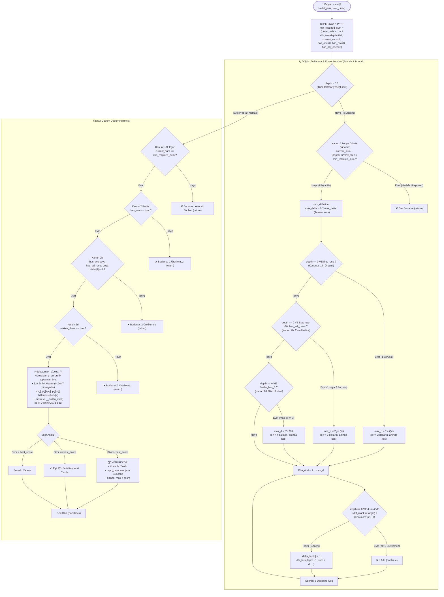
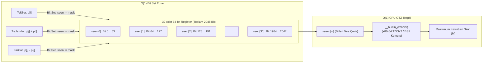

# PSPP C Arama Motoru (solver.c) Algoritma ve Kısıt Mimarisi

Bu doküman, [solver.c](file:///c:/Users/icduser/Documents/GitHub/Ugraslar/PSPP/pspp%200826/solvers/solver.c) içerisinde uygulanan **Ters DFS (Reverse Branch & Bound)** arama algoritmasını, **Kesin Matematiksel Kanunlar** budama mekanizmasını ve **2048-bit donanımsal bitmask skorlama mimarisini** ayrıntılı olarak açıklamaktadır.

---

## 1. Algoritma Akış Şeması (Mermaid)

Aşağıdaki şemada, **Ters DFS (Reverse Branch & Bound)** motorunun adımları, iç düğüm ve yapraktaki budama kontrolleri ile yaprak düğümlerdeki **2048-Bit Donanımsal Bitmask Motoru** gösterilmektedir:



---

## 2. Kesin Matematiksel Kanunlar ve solver.c Uyumu

[solver.c](file:///c:/Users/icduser/Documents/GitHub/Ugraslar/PSPP/pspp%200826/solvers/solver.c), evrensel ve kesin arama yapan bir çözücüdür. Bu nedenle [DIZI_KURALLARI.md](file:///c:/Users/icduser/Documents/GitHub/Ugraslar/PSPP/pspp%200826/docs/DIZI_KURALLARI.md) içerisinde tanımlanan **Kesin Matematiksel Kanunlar**'ı eksiksiz uygular:

| # | Kanun Adı | Kod Konumu | Matematiksel Formül | Uygulama & Budama Yöntemi |
|---|---|---|---|---|
| **1** | **Tepe Kapanış & Dinamik Alt Eşik** | solver.c | sum(delta) >= ceil((hedef_esik + 1) / 2) | **İleriye Dönük Dal & Yaprak Budaması:** Kalan adımlar maksimum delta ile doldurulsa dahi asgari toplamı veremiyorsa dal hiç ziyaret edilmeden kesilir. Yaprakta yetersiz toplamlar bitmask motoruna sokulmadan `return` edilir. |
| **2** | **1'in Üretilmesi & Parite Kanunu** | solver.c | exists k : delta_k = 1 | **Erken Dal Kısıtlama & Yaprak Budaması:** Eğer `depth == 0`'a kadar hiç `1` seçilmemişse (`!has_one`), 1 üretilebilmesi için son eleman delta[0] = 1 olmak zorundadır. d >= 2 olan tüm dallar döngü `max_d = 1` yapılarak anında kesilir. |
| **2b**| **2'nin Üretilmesi Kanunu** | solver.c | delta_0=1 OR exists delta_k=2 OR exists [1,1] | **Erken Dal Kısıtlama (max_d <= 2):** Eğer suffix'te 2 veya [1, 1] yoksa, 2 üretilebilmesi için delta[0] elemanı 1 veya 2 olmak zorundadır. d >= 3 olan tüm dallar döngü `max_d = 2` yapılarak anında elenir. |
| **2c**| **p0 - 1 Üretilme Kanunu (p0 >= 4)**| solver.c | exists (j > i) : p_j - p_i = p_0 - 1 | **Erken Dal Budaması (O(1) Bitmask):** d >= 4 (yani p0 - 1 >= 3) için, (d - 1) sayısı kuyruk farklarında yoksa dal doğrudan `continue` ile atlanır. |
| **2d**| **3'ün Üretilmesi Kanunu** | solver.c | 3 OR [1,2] OR [2,1] OR [1,1,1] OR [1,1] basta | **Erken Dal Kısıtlama (max_d <= 3):** Kuyrukta 3 üretimi yoksa `max_d = 3` yapılır, d >= 4 seçenekleri ve geçersiz d=1,2 durumları anında budanır. |
| **3** | **Güvercin Yuvası Mutlak Tavanı** | solver.c | max(p) <= P^2 + P | **Arama Uzayı Sınırlandırması:** Toplamı P^2+P'yi aşacak hiçbir kombinasyon döngüye dahi giremez (max_d = tavan - current_sum). |

---

### Sezgisel Kısıtlar Neden solver.c'de Kullanılmaz?

Önceki prototiplerde yer alan bazı deneysel kısıtlar (örneğin $\delta \le 2P$ hibrit sınırı, ikinci eleman sınırı $\delta_1 \le (P-1)\delta_0$, ortanca eleman sınırı $p_{mid} \le \frac{P^2+P}{2}$ ve kuyruk daralma kuralı), [DIZI_KURALLARI.md](file:///c:/Users/icduser/Documents/GitHub/Ugraslar/PSPP/pspp%200826/docs/DIZI_KURALLARI.md) Bölüm 2'de açıklandığı üzere **Sezgisel Kısıtlar** sınıfındadır.

- Bu kısıtlar modüler aileleri hızlandırsa da, **Aile 3 (Uç Sıçraması)** gibi asimetrik küresel rekorları eler.
- Bu nedenle `solver.c` kesin çözücüsünde sezgisel kısıtlar **kaldırılmış**, arama mutlak teorik tavana kadar evrensel bırakılmıştır.

---

## 3. Donanımsal 2048-Bit CTZ Bitmask Motoru (`deltatomax_c`)

Klasik dizi veya hash kümesi (`Set`) kontrolleri yerine CPU'nun 64-bit yazmaçlarını donanımsal düzeyde kullanan ultra hızlı bir yöntem uygulanmıştır:



### Bitmask Çalışma Prensibi:
1. **Delta -> Prefix Sum:** $\delta = [2, 2, 1, 14, 1, 11, 1] \longrightarrow p = [2, 4, 5, 19, 20, 31, 32]$
2. **Bit Set Etme:**
   - Her $p_i$, $(p_j + p_i)$ ve $(p_j - p_i)$ değeri hesaplanır ve ilgili 64-bit bloğundaki bit `seen[v >> 6] |= (1ULL << (v & 63))` ile tek bir işlemci komutunda `1` yapılır.
3. **İlk Eksik Sayıyı Bulma ($O(1)$ CTZ):**
   - Word'ler sırayla taranır; `val = ~seen[w]` hesaplanır.
   - İlk `0` olan bit (üretilemeyen ilk pozitif tamsayı), x86-64 işlemci komutu olan `TZCNT` / `BSF` (`__builtin_ctzll`) ile **tek bir makine çevriminde ($O(1)$)** tespit edilir.

---

## 4. Zaman ve Alan Karmaşıklığı

- **Bellek Karmaşıklığı (Space Complexity):** $O(P)$
  - Sadece derinlik yığını (call stack) ve 64 elemanlık statik diziler kullanılır. Sıfır dinamik bellek (`malloc`) tahsisi.
- **Tek Dizi Değerlendirme Süresi:** $\approx 15 \text{ - } 25 \text{ nanosaniye}$
  - Bitmask ve donanımsal CTZ sayesinde saniyede **~20 - 35 milyon kombinasyon** test edilebilir.

---

## 5. Kullanım ve Parametreler

Derleme:
```powershell
gcc -O3 -finput-charset=UTF-8 -fexec-charset=UTF-8 solvers/solver.c -o solvers/solver.exe
```

Çalıştırma Örnekleri:
- **İnteraktif Mod:**
  ```powershell
  .\solvers\solver.exe
  ```
- **Komut Satırı Parametreleri:**
  ```powershell
  .\solvers\solver.exe 8 --esik 130 --max-delta 25
  ```
