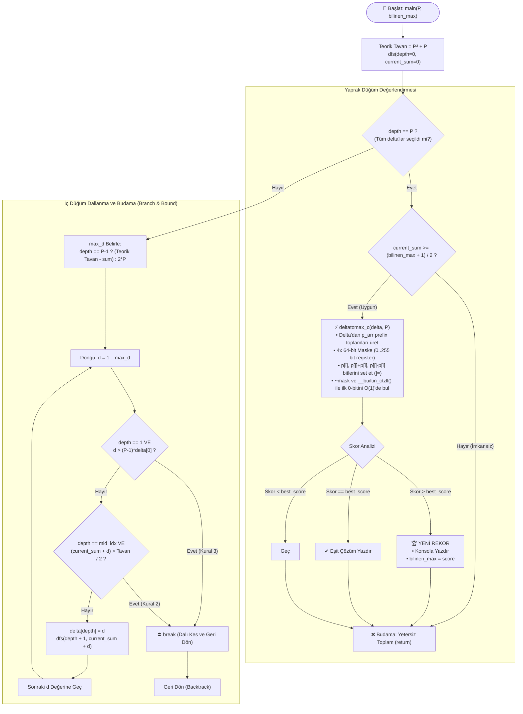

# PSPP C Arama Motoru (solver.c) Algoritma ve Kısıt Mimarisi

Bu doküman, [solver.c](file:///c:/Users/icduser/Documents/GitHub/Ugraslar/PSPP/pspp%200826/solver.c) içerisinde uygulanan arama algoritmasını, matematiksel kısıtları, budama (pruning) kurallarını ve 64-bit donanımsal bitmask skorlama mimarisini ayrıntılı olarak açıklamaktadır.

---

## 1. Algoritma Akış Şeması (Mermaid)

Aşağıdaki şemada, **Branch & Bound DFS (Derinlemesine Arama)** motorunun adımları, budama kontrolleri ve yaprak düğümlerdeki **Bitmask Değerlendirme Motoru** gösterilmektedir:



---

## 2. Koddaki Tüm Kısıtlar ve Budama Kuralları

[solver.c](file:///c:/Users/icduser/Documents/GitHub/Ugraslar/PSPP/pspp%200826/solver.c) içerisinde arama uzayını milyarlarca gereksiz kombinasyondan arındıran **6 temel kısıt ve budama mekanizması** bulunmaktadır:

| # | Kısıt Adı | Kod Konumu | Matematiksel Formül | Mantıksal & Teorik Açıklama |
|---|---|---|---|---|
| **1** | **Hibrit Delta Üst Sınırı** | [Satır 91](file:///c:/Users/icduser/Documents/GitHub/Ugraslar/PSPP/pspp%200826/solver.c#L91) | İlk $P-1$ eleman: $d \le 2P$<br>Son eleman: $d \le (P^2+P) - \sum \delta$ | İlk $P-1$ adımda adımlar kompakt tutulur ($2P$), son eleman ise yeni rekorları ve uç sıçramaları kaçırmamak için mutlak tavana kadar serbest bırakılır. |
| **2** | **İkinci Eleman Budaması** | [Satır 96](file:///c:/Users/icduser/Documents/GitHub/Ugraslar/PSPP/pspp%200826/solver.c#L96) | $\delta_1 \le (P-1) \times \delta_0$ | İkinci fark ilk farkın $(P-1)$ katını aşarsa, $1$ ile $\delta_1$ arasındaki boşluklar diğer elemanlarla doldurulamaz; dal doğrudan `break` ile kesilir. |
| **3** | **Ortanca Eleman Budaması** | [Satır 97](file:///c:/Users/icduser/Documents/GitHub/Ugraslar/PSPP/pspp%200826/solver.c#L97) | $p_{mid} \le \frac{P^2+P}{2}$ | $mid = \lfloor \frac{P-1}{2} \rfloor$. Dizinin orta noktasındaki eleman teorik tavanın yarısını aşarsa zincir kopar; `break` ile erken sonlandırılır. |
| **4** | **Son Eleman Alt Sınırı** | [Satır 71](file:///c:/Users/icduser/Documents/GitHub/Ugraslar/PSPP/pspp%200826/solver.c#L71) | $\sum \delta \ge \frac{\text{bilinen\_max} + 1}{2}$ | İki eleman toplamıyla ulaşılabilecek en büyük sayı $2 \times p_{P-1}$'dir. Eğer son eleman hedefin yarısından küçükse, o hedefe ulaşması imkansızdır; yaprak test edilmeden atılır (`return`). |
| **5** | **Mutlak Teorik Tavan** | [Satır 108](file:///c:/Users/icduser/Documents/GitHub/Ugraslar/PSPP/pspp%200826/solver.c#L108) | $\max(p) \le P^2 + P$ | $P$ elemanlı bir kümenin üretebileceği toplam tekil işlem sayısı en fazla $P^2+P$'dir. Bu değeri aşan dizilerde güvercin yuvası ilkesi gereği delikler kaçınılmazdır. |
| **6** | **Dinamik Rekor Filtresi** | [Satır 80](file:///c:/Users/icduser/Documents/GitHub/Ugraslar/PSPP/pspp%200826/solver.c#L80) | `if (score > bilinen_max) bilinen_max = score` | Daha yüksek bir skor bulunduğunda arama tabanı yükseltilir; sonraki yapraklar daha sert alt sınıra takılarak elenir. |

---

## 3. Donanımsal 64-Bit Bitmask Motoru (`deltatomax_c`)

Klasik dizi veya küme (`Set`) kontrolleri yerine CPU'nun 64-bit yazmaçlarını donanımsal düzeyde kullanan ultra hızlı bir yöntem uygulanmıştır:

```mermaid
graph LR
    subgraph Bitmask_Yapisi [" 4 Adet 64-bit Register (Toplam 256 Bit) "]
        M0["mask0: Bit 0 .. 63"]
        M1["mask1: Bit 64 .. 127"]
        M2["mask2: Bit 128 .. 191"]
        M3["mask3: Bit 192 .. 255"]
    end
    
    subgraph Uretim [" O(1) Bit Set Etme "]
        P_i["Tekliler: p[i]"] -->||= (1ULL << val)| Bitmask_Yapisi
        Sum["Toplamlar: p[j] + p[i]"] -->||= (1ULL << val)| Bitmask_Yapisi
        Diff["Farklar: p[j] - p[i]"] -->||= (1ULL << val)| Bitmask_Yapisi
    end
    
    subgraph Donanim_Hesaplama [" O(1) CPU CTZ Tespiti "]
        Bitmask_Yapisi --> Inv["~mask (Bitleri Ters Çevir)"]
        Inv --> CTZ["__builtin_ctzll(inv)<br>(Donanımsal Sıfır Sayacı)"]
        CTZ --> Score["Maksimum Kesintisiz Skor (M)"]
    end
```

### Bitmask Çalışma Prensibi:
1. **Delta -> Prefix Sum:** $\delta = [2, 2, 1, 14, 1, 11, 1] \longrightarrow p = [2, 4, 5, 19, 20, 31, 32]$
2. **Bit Set Etme:**
   - Her $p_i$, $(p_j + p_i)$ ve $(p_j - p_i)$ değeri hesaplanır ve ilgili 64-bit bloğundaki bit `1` yapılır.
3. **İlk Eksik Sayıyı Bulma:**
   - `mask0` ters çevrilip 1 bit sağa kaydırılır (`~mask0 >> 1`).
   - İlk `0` olan bit (üretilemeyen ilk pozitif tamsayı), x86-64 işlemci komutu olan `TZCNT` / `BSF` (`__builtin_ctzll`) ile **tek bir makine çevriminde ($O(1)$)** bulunur.

---

## 4. Zaman ve Alan Karmaşıklığı

- **Bellek Karmaşıklığı (Space Complexity):** $O(P)$
  - Sadece derinlik yığını (call stack) ve 32 elemanlık statik diziler kullanılır. Sıfır heap (`malloc`) tahsisi.
- **Tek Dizi Değerlendirme Süresi:** $\approx 15 \text{ - } 25 \text{ nanosaniye}$
  - Bitmask ve donanımsal CTZ sayesinde saniyede **~20-30 milyon kombinasyon** test edilebilir.
